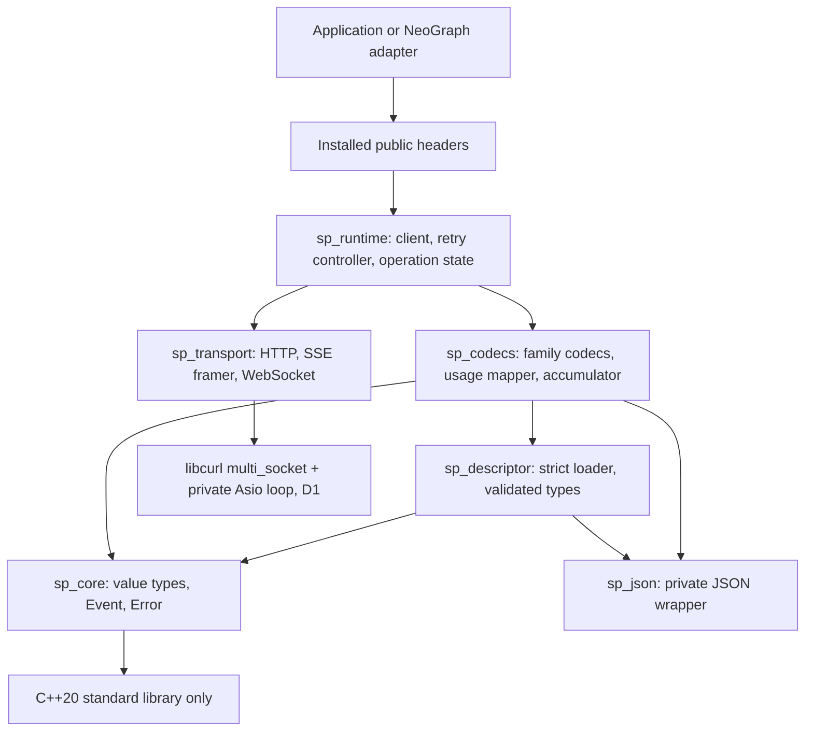

# SchemaProvider design

## 0. Status

**This document describes the full target, not an implemented release.** The private PoC now contains the libcurl-on-Asio transport, SSE framer, strict first-cell descriptor loader, Chat Completions buffered/SSE codec, common events and one accumulator. Only the measured scopes in [POC_PLAN.md](POC_PLAN.md) are execution evidence; there is no installed header or stable client runtime. Other sketches remain contracts to build and test. Statements about other projects and the current NeoGraph implementation are summarised in [RESEARCH.md](RESEARCH.md). Named requirements live in [CONFORMANCE.md](CONFORMANCE.md), decisions in [decisions/](decisions/README.md), and release gates in [ROADMAP.md](ROADMAP.md). Section 12's open decisions remain open.

Words: MUST, SHOULD, MAY are used as in RFC 2119. "Family" means a wire protocol shape (Chat Completions, Responses, Messages, Gemini generate, Interactions). "Vendor" means an endpoint operator speaking a family. "Descriptor" means a JSON file of vendor values. Labels: `[read docs]` = a primary vendor page was read while writing; `[INFERENCE]` = not observed, reasoned; "unverified" = a claim that a fixture or canary must still establish.

## 1. Thesis and non-goals

**Thesis.** The API family owns structure and state transitions in typed C++. A vendor descriptor supplies only the values of that structure. Every response path (buffered, SSE, WebSocket) is decoded into the same small set of semantic events and folded by one accumulator. The reason for the split is not speed; it is to shrink the change surface of a vendor update and to make "a wrong result reported as success" hard to express.

```
Request -> validated immutable plan -> one-attempt transport -> family frame decoder
        -> semantic Event -> ONE accumulator -> Completion | Failure
```

Non-goals:

- No generic bidirectional "universal IR" or gateway feature. Events are decoded one way and folded; they are never re-encoded into another vendor's wire format, and no event persistence format is promised.
- No cross-vendor continuity of native reasoning state (signed or encrypted reasoning cannot be translated).
- No public codec SDK, public transport port, executor framework, middleware chain, or binary plugin ABI. New families are source contributions.
- No descriptor scripting: no event actions, hooks, conditionals over state, templates or loops (section 5).
- No graph/agent runtime, tool execution, cost tables, tenant billing, circuit breaker, or cross-vendor fallback. Those stay in the host.
- No Python or other language bindings until the C++ API settles.
- **Non-chat endpoints are out of the first release (D2, FIRM):** standalone image endpoints, long-running video operations and the OpenRouter decisions endpoint are not covered by the Event set and not supported. Artifacts that arrive inside a chat response (`Completion.artifacts`) are in scope. NeoGraph owns the cutover of those features (section 13).
- **Native access to Amazon Bedrock or Google Cloud Vertex is out of scope** unless separately designed: SigV4 signing, OAuth/Azure AD style credential refresh and AWS binary event-stream framing are not in this design. A vendor is reachable only through an HTTP endpoint that a descriptor can express with a static credential binding.

## 2. Architecture

### 2.1 Layers and dependency direction

Arrows mean "depends on" (compile-time), not call flow.



Rules:

1. `sp_core` depends on the C++20 standard library only. It does not know HTTP, JSON libraries, descriptors, or NeoGraph.
2. Codecs are pure with respect to I/O: they consume frames and emit events; they never perform retries, sleeps, or sockets.
3. The transport reports one `AttemptObservation` (bytes sent, response headers seen, close/reset kind, transport-internal resends) and never interprets semantics or retries. Whether semantic output was observed is an accumulator/runtime judgment, not a transport one (section 3.6).
4. Only the runtime owns retry, deadlines, cancellation and threads.
5. NeoGraph-specific pieces (coroutine bridge, graph cancellation token, journal digest) live in NeoGraph, not here.

### 2.2 Public vs private

Installed headers (proposed, six): `client.h`, `types.h`, `event.h`, `error.h`, `json_value.h`, `version.h`, under `include/schemaprovider/`. One installed target: `SchemaProvider::SchemaProvider`. The six headers are documentation boundaries, not six products. Header count is not a quality metric; the metrics are section 2.4.

Private (not installed, no stability promise): all `sp_*` object targets, codec headers, descriptor structs, transport ports, the retry controller, the reference model used in tests.

`JsonValue` is a small immutable owner of validated JSON text with parse/serialize and bounded lookup only. It has no DOM mutation, no raw parser pointers, no general transformation API. It exists so tool parameter schemas and tool arguments carry validation evidence (duplicate keys rejected, depth bounded) and are not re-validated at each boundary. Callers may read arguments with their own JSON library.

### 2.3 Third-party dependencies per layer

| Layer | Allowed dependencies |
|---|---|
| `sp_core` | C++20 standard library |
| `sp_json` | yyjson (private; never in a public header) |
| `sp_descriptor` | `sp_core`, `sp_json` |
| `sp_codecs` | `sp_core`, `sp_json`, `sp_descriptor`; private OpenSSL Crypto for M3 replay fingerprints |
| `sp_transport` | libcurl (`multi_socket`) driven by a private standalone Asio loop; TLS through libcurl's backend (D1, FIRM) |
| `sp_runtime` | the above, standard threads, `std::stop_token` |
| public headers | standard library only |

In the private M3 build, `src/core/native.cpp` belongs to the `sp_codecs` target, not `sp_core`. Its SHA-256 implementation links `OpenSSL::Crypto` privately and exposes no OpenSSL types in a header; `sp_core` remains standard-library-only. This is content/binding integrity inside trusted code, not authentication of the capsule issuer.

No language runtimes, no general JSON Schema validator, no second HTTP stack, no `httplib`, no hand-written HTTP/1.1 client, no runtime backend flag: libcurl is the single HTTP stack and is private to `sp_transport`. `SP_ENABLE_WEBSOCKET` selects a transport implementation only; it does not change the semantic contract (the WebSocket transport itself is the undecided D1b). The default descriptors are embedded at configure time (a generated index; no runtime directory globbing, no fetch).

**Optional HTTP/3 (accepted direction, not implemented).** [D1's HTTP/3 policy](decisions/D1-transport.md#optional-http3-policy) is authoritative: capable builds can prefer HTTP/3 with same-origin HTTPS connection-stage fallback to HTTP/2/HTTP/1.1; incapable builds keep the existing path. QUIC dependencies stay behind libcurl, not in codecs or installed headers. This protocol preference is not a second backend selector. Provider request/response semantics, SSE framing, events, accumulation and NeoGraph call sites remain shared. Baseline release gates do not require a QUIC-enabled build; advertising HTTP/3 does require the separate conformance gate.

### 2.4 Include-direction gate

CI MUST fail when any of these hold (property `InstallAndDependencyDAG`). The forbidden edges are listed once here and CONFORMANCE refers to this list:

- an installed header includes yyjson, asio, OpenSSL, `httplib`, curl, a QUIC-backend header, or any `src/` header;
- `sp_core` links or includes anything but the standard library;
- the CMake target graph has an edge from `sp_core` or `sp_descriptor` to `sp_codecs`, `sp_transport` or `sp_runtime`, or from `sp_codecs` to `sp_transport`;
- a clean consumer project fails to `find_package`, compile each public header standalone, link, and complete one loopback request against the installed tree.

The check reads compile commands and compiler dependency output, and inspects the target graph; it does not rely on grep of source alone. Measurable proxies (to be tracked after implementation; not results): public dependency leaks = 0; accumulator implementations = 1; retry-owning classes = 1; vendor-name branches in shared code = 0 (counted by a named-vendor token scan of `sp_codecs` shared files and `sp_runtime`); C++ files touched to add a strict-compatible vendor = 0 (measured on each real addition, section 9).

## 3. Core vocabulary

The sketches are intended to compile as C++20 against a stub `JsonValue`; a CI step (`sketch-compile`) extracts and compiles them. Simple helper types are given minimal bodies so nothing is undefined. Names may change; the invariants in the prose are the contract.

**Error model (one sentence).** Everything that can fail at runtime returns a value: `Result<T>` (a library type; `std::expected` is C++23) from the factory, the descriptor loader and `Client::option`, `Outcome` from `complete()`/`start()`, and `Status` from `join()`; exceptions are not part of the contract except `std::bad_alloc`, and programmer misuse (join from a callback, use after close) is reported as `ErrorKind::Misuse`, never as undefined behaviour or abort.

### 3.1 Origin and binding facts

```cpp
#include <chrono>
#include <cstddef>
#include <cstdint>
#include <map>
#include <memory>
#include <optional>
#include <span>
#include <string>
#include <string_view>
#include <variant>
#include <vector>
namespace sp {
class JsonValue;   // immutable validated JSON text; defined in json_value.h

struct Origin {
  std::string family;      // "openai.responses", "anthropic.messages", ...
  std::string vendor;      // stable descriptor id, not a display name
  std::string authority;   // normalized effective host + API surface
  std::string route_scope; // caller-supplied non-secret binding (deployment, tenant, credential class)
  friend bool operator==(const Origin&, const Origin&) = default;
};

// Facts the codec checks before dispatch; recorded per capsule by the decoder.
struct BindingFacts {
  std::string model;                // producing model id as returned by the wire
  std::string context_fingerprint;  // digest of the replay prefix (system, tools, preceding messages as sent)
  std::string account_scope;        // non-secret credential-profile / account label; never derived from a secret
  friend bool operator==(const BindingFacts&, const BindingFacts&) = default;
};
}
```

Design position (D4, FIRM), from what vendor documentation says `[read docs]` (Anthropic extended-thinking page, sections on signatures, block binding and cross-platform use): signature values are compatible across the Claude API, Bedrock and Vertex; a thinking block is readable only by the producing model and some others, and unreadable blocks are silently dropped; newer models bind blocks to the preceding system/tools/messages prefix (a changed prefix is a 400 where enforced; enforcement is default for accounts created on or after 2026-08-31 and opt-in for older ones); some models' blocks are account-bound; toggling thinking mid-turn silently disables it. Consequences:

1. Exact `Origin` equality is the default replay gate. It is a necessary, not a sufficient, condition. `route_scope` is never key material and is never derived by hashing a credential.
2. **Each capsule also records `BindingFacts`.** Before dispatch the codec compares them with the request being built: model id, context fingerprint, account scope. A mismatch is `ReplayIneligible` before any network I/O (property `OriginBindingFacts`).
3. **Documented equivalence class.** A class (for example Messages across direct, Bedrock and Vertex) exists only as a C++ allow-list in the family codec with status `Documented-Unverified`. It is activated per canary cell after a negative-control canary passes (section 6, property `CanaryNegativeControl`). Descriptors cannot declare, extend or activate a class. OpenRouter is never in a class: a recorded live run of OpenRouter-issued signed thinking replayed to Anthropic failed in roughly 40-50% of runs with an invalid-signature error, cause unknown, and OpenRouter accepted tampered signatures with a 200, so its acceptances are not evidence. Bedrock/Vertex entries are declared but inert while native access is out of scope (section 1) and the credentials question is open (section 12, O2).
4. Origin is an observed/configured replay boundary, **not cryptographic proof of issuer**. "Sealed" means C++ immutability plus provenance, not authentication (threat model, section 6.1).

### 3.2 Native state and sealed capsules

```cpp
namespace sp {
class CapsuleKey;  // passkey: constructible only by trusted decoders and the history importer

// Immutable, shared. Private state; no setters; the only factory takes the passkey.
class SealedCapsule {
 public:
  static std::shared_ptr<const SealedCapsule> make(
      CapsuleKey, Origin, BindingFacts, int representation_version, bool complete,
      std::vector<std::byte> bytes, std::vector<std::string> owner_part_keys);
  const Origin& origin() const { return origin_; }
  const BindingFacts& binding() const { return binding_; }
  int representation_version() const { return version_; }
  bool complete() const { return complete_; }                    // false => never replay natively
  std::span<const std::byte> bytes() const { return bytes_; }    // opaque; never logged
  const std::vector<std::string>& owner_part_keys() const { return owners_; } // ordered group
 private:
  SealedCapsule(Origin, BindingFacts, int, bool, std::vector<std::byte>, std::vector<std::string>);
  Origin origin_; BindingFacts binding_; int version_; bool complete_;
  std::vector<std::byte> bytes_; std::vector<std::string> owners_;
};
struct NativeState { std::shared_ptr<const SealedCapsule> capsule; };
}
```

The capsule holds the whole native item or block, its owning part keys (an **ordered group**: removing any member invalidates the whole group), original position, origin, binding facts, representation version and a completeness flag. Opaque string values are never trimmed, re-encoded or canonicalised.

**Immutability is enforced by the type system.** Decoded `Message`s are reachable only as `std::shared_ptr<const Message>`; `Message` has no mutating member. Editing goes through `MessageBuilder`, which copies; editing text, order or ownership of a part inside a capsule group yields a builder result whose group has no seal, and a later native replay fails with `ReplayIneligible` rather than sending a stale block. History is a persistent (shared-prefix) list, so appending a turn is O(1) and a long conversation does not cost O(N²) copies.

### 3.3 Parts, Message, Request

```cpp
namespace sp {
enum class Role { System, Developer, User, Assistant, Tool };
struct Url { std::string value; };
struct FileId { std::string value; };
struct SharedBytes { std::shared_ptr<const std::vector<std::byte>> data; };
struct Text  { std::string value; };
struct Media { std::string mime; std::variant<Url, FileId, SharedBytes> data; };

enum class ToolCallKind { ClientExecuted, ServerExecuted, ApprovalRequest };
struct FreeformText { std::string value; };            // raw (non-JSON) tool input, e.g. custom/freeform tools
enum class InvalidReason { Truncated, NotJson, DuplicateKey, DepthExceeded, Empty, Other };

// Executable only when sealed. ServerExecuted calls are records of vendor-side work, never executed by the host.
struct ToolCall {
  std::string id; std::string name; ToolCallKind kind = ToolCallKind::ClientExecuted;
  std::variant<std::shared_ptr<const JsonValue>, FreeformText> input;
};
// A call whose arguments did not seal (for example cut by max tokens, or model-invalid JSON).
struct InvalidToolCall {
  std::string id; std::string name; ToolCallKind kind = ToolCallKind::ClientExecuted;
  std::string raw_fragment; InvalidReason reason = InvalidReason::Other;
};
struct ToolResult { std::string call_id; std::string name; std::shared_ptr<const JsonValue> value; bool is_error = false; };
struct Reasoning  { std::optional<std::string> visible; NativeState native; };
struct Refusal    { std::string text; std::string raw_code; };
struct Opaque     { std::string wire_type; NativeState native; }; // unknown optional item kept, not a JSON escape hatch
using Part = std::variant<Text, Media, ToolCall, InvalidToolCall, ToolResult, Reasoning, Refusal, Opaque>;

class Message {
 public:
  const std::string& id() const { return id_; }                  // vendor item id when one exists
  Role role() const { return role_; }
  const std::vector<Part>& parts() const { return parts_; }      // order is semantic
  const std::optional<std::string>& phase() const { return phase_; } // open string, per item
 private:
  friend class MessageBuilder; friend class Accumulator;
  std::string id_; Role role_ = Role::User; std::vector<Part> parts_; std::optional<std::string> phase_;
};
using MessagePtr = std::shared_ptr<const Message>;
class History;                                    // persistent list of MessagePtr; append is O(1)

struct ToolDefinition { std::string name, description; std::shared_ptr<const JsonValue> parameters; };
struct Sampling { std::optional<double> temperature, top_p; };
struct BoundOption { std::string key; std::shared_ptr<const JsonValue> value; };   // made only by Client::option
enum class ForeignReasoning { Reject, DemoteReference, Drop };

enum class ContinuationLifetime { Persisted, ConnectionBound };
struct Continuation {                                              // origin-bound server-side state reference
  Origin origin; std::string reference; int representation_version = 1;
  ContinuationLifetime lifetime = ContinuationLifetime::Persisted;
  std::string connection_epoch;                                    // set only when ConnectionBound
};

struct StructuredOutput { std::string name; std::shared_ptr<const JsonValue> schema; bool strict = false; };
struct ReasoningRequest;                                           // section 3.7

struct Request {
  std::string model;
  std::shared_ptr<const History> history;
  std::vector<ToolDefinition> tools;
  Sampling sampling;
  std::optional<uint64_t> max_output_tokens;
  std::optional<StructuredOutput> output;
  std::shared_ptr<const ReasoningRequest> reasoning;
  std::optional<Continuation> continuation;
  std::vector<BoundOption> options;                                // validated namespaced keys; not a raw body merge
  ForeignReasoning foreign_reasoning = ForeignReasoning::Reject;
};
}
```

Contracts:

- Part order inside a message and message order inside a completion follow the family's explicit item order or key, not network arrival order. Local ids are allocated canonically and are not identity.
- **A tool call is executable only as a sealed `ToolCall` with `kind == ClientExecuted`**, name and id present, arguments complete and validated (an explicit empty object is distinct from missing). The decoder never promotes server-executed work to a host call: Anthropic `server_tool_use`, Responses web-search / code-interpreter / MCP call items and Gemini executable-code parts become `ToolCall` (kept for replay and display, not counted for `ToolUse`) (property `ServerToolNotExecuted`). Vendor approval requests (for example an MCP approval item) are `ApprovalRequest`; the host must answer them. A paused turn (`PauseTurn`) is replayed by resending the assistant content as produced; the codec defines what a resume request contains.
- **Tool input is `variant<JsonValue, FreeformText>`**: OpenAI custom/freeform tool input is a raw string and is never parsed or JSON-wrapped.
- **An unsealed call is a value, not a loss.** When a terminal arrives while arguments are incomplete (typically `MaxTokens` cutting a tool use), or the sealed text is invalid JSON or has a duplicate key, the completion carries an `InvalidToolCall` (kind, id, name, bounded raw fragment, reason); text, usage and stop survive and the host can feed back an error result. Model-invalid JSON is classified separately from wire corruption: it is `InvalidToolCall`, not `ProtocolCorrupt`. Never repaired or guessed (property `InvalidToolCallRepresentation`). The fixture that injects a cut tool use with `MaxTokens` expects `Completion{stop=MaxTokens, InvalidToolCall{Truncated}}`, not `Failure`.
- `Continuation` is `(origin, opaque reference, representation version, lifetime)`. A `Persisted` reference may be resumed later; a `ConnectionBound` one (Responses over WebSocket with `store=false`) is valid only on the connection epoch that produced it and is never persisted in a journal. A reference is never usable from a different origin, and combining explicit history with a continuation is allowed only in combinations the codec documents. The library never silently falls back to full input when a continuation fails (section 4.6).
- One generation, one candidate. `n != 1` is `Unsupported`. Several ordered messages inside one generation (for example commentary, function call, final answer) are normal.
- `BoundOption` is obtained from `Client::option(key, value)` (a `Result`), which validates the key against the descriptor. A key that is not declared, or that collides with a typed field or a reserved path, is an error before any network I/O (`IntentOrError`).

### 3.4 Events

Ten semantic events, response-scoped, one-way. Attempt lifecycle, retries, acceptance and diagnostics are NOT events. (Polling of long-running operations is out of scope, D2.)

```cpp
namespace sp {
struct LocalId { uint32_t value = 0; friend bool operator==(LocalId, LocalId) = default; };
enum class PartKind { Text, Media, ToolCall, ToolResult, Reasoning, Refusal, Opaque };
struct PartHeader { std::string wire_id, name; ToolCallKind tool_kind = ToolCallKind::ClientExecuted; };
struct DeltaPayload { PartKind kind; std::string_view bytes; };    // view valid only during the callback
struct SealedPart { Part part; };
struct TerminalEvidence { std::string kind; };                     // family-defined tag, see 4.2
struct ConversionLoss { std::string kind, detail; };
struct UsageConflict { std::string counter, detail; };
struct Usage;                                                      // section 3.5
struct Error;                                                      // section 3.6
struct StopReason;

struct Begin        { std::string generation; Origin origin; };
struct MessageBegin { LocalId message; std::optional<std::string> vendor_id; Role role = Role::Assistant; std::optional<std::string> phase; };
struct PartBegin    { LocalId message, part; PartKind kind = PartKind::Text; PartHeader header; };
struct PartDelta    { LocalId part; DeltaPayload payload; };       // text | visible reasoning | tool-args fragment
struct PartSeal     { LocalId part; SealedPart value; };           // authoritative final snapshot: reconcile, never append
struct MessageSeal  { LocalId message; };
struct UsageUpdate  { std::shared_ptr<const Usage> snapshot; };    // full normalized absolute snapshot
struct Stop         { std::shared_ptr<const StopReason> reason; };
struct Commit       { TerminalEvidence evidence; };                // family terminal evidence verified
struct Fail         { std::shared_ptr<const Error> error; };
using Event = std::variant<Begin, MessageBegin, PartBegin, PartDelta, PartSeal,
                           MessageSeal, UsageUpdate, Stop, Commit, Fail>;
}
```

Delta payload views are valid only for the callback duration. Retaining requires an explicit copy. Opaque reasoning bytes are never placed in delta events or logs. Every vendor delta kind that the codec knows but cannot map (annotations, citations, refusal deltas, stop details, server-side fallback blocks) is either mapped to a part or recorded as a `ConversionLoss`; none vanishes silently. The codec defines, per kind, the replay projection including what is dropped.

### 3.5 Usage: unknown is not zero

```cpp
namespace sp {
enum class Evidence { Reported, Derived };
struct Count { uint64_t value = 0; Evidence evidence = Evidence::Reported; };
enum class UsageStage   { Missing, Partial, Final };       // independent axis
enum class UsageQuality { Consistent, Inconsistent };      // independent axis
struct Usage {
  std::optional<Count> input_total, output_total, total;   // total = known input+output
  std::optional<Count> provider_reported_total;            // kept verbatim, separate from `total`
  std::optional<Count> input_uncached, cache_read, cache_write, reasoning;
  std::map<std::string, Count> extra;                      // vendor counters without a typed slot, e.g. "cache_write:5m", "cache_write:1h", "tool_use_prompt"
  UsageStage stage = UsageStage::Missing; UsageQuality quality = UsageQuality::Consistent;
  std::vector<UsageConflict> conflicts;                    // raw observations kept
};
}
```

- `nullopt` means unknown/unobserved. An explicit zero is a value. A consumer MUST NOT settle unknown as zero.
- The public `UsageUpdate` is a complete snapshot. The accumulator replaces its usage with it, so a snapshot in which a contradicted counter is `nullopt` turns a previously known value back into unknown. This is how a late contradiction invalidates a stale number.
- Vendor counter semantics are handled privately by one shared `UsageMapper` with a per-attempt source ledger (rules in 4.5). The public event never exposes source counters. `extra` carries counters that have no typed slot (for example cache-write by TTL tier) so they are not lost; cost tables stay outside.
- Algebra: `input_total` includes cached tokens; `output_total` includes reasoning tokens; `cache_read`/`cache_write` decompose input; `reasoning` is a subset of output. Impossible relations make the affected derived counts unknown and record a `UsageConflict`; values are never clamped. Wrong types, negative values and overflow are `ProtocolCorrupt`.
- Repeating the same final snapshot changes nothing. Estimated values are never labelled `Reported`. After a failure, usage is the last known partial snapshot.
- Cost tables, tool fees and retry-attempt billing are outside `Usage` (host metering).

Tested by `UsageKnowledgeTransitions` and `SnapshotNotAppend`.

### 3.6 Completion, Stop, Error

```cpp
namespace sp {
enum class StopKind { EndTurn, ToolUse, MaxTokens, StopSequence, ContentFilter,
                      Refusal, PauseTurn, ContextLimit, MalformedCall, Unknown };
struct StopReason { StopKind kind = StopKind::Unknown; std::string raw; };

struct Artifact { Media media; std::string source; };             // arrives inside a chat response
struct Usage;
struct Completion {
  std::vector<MessagePtr> messages;      // ordered; Responses item ids/phases survive
  std::vector<Artifact> artifacts;
  StopReason stop;
  std::shared_ptr<const Usage> usage;
  std::optional<Continuation> continuation;
  std::string request_id;                // vendor request id when the wire gives one
  std::vector<ConversionLoss> losses;    // reporting only; not part of completion identity
};

enum class ErrorKind { InvalidConfig, InvalidRequest, Unsupported, Authentication,
  Permission, NotFound, RateLimited, QuotaExhausted, LimitUnknown, Overloaded,
  Transport, ProtocolCorrupt, Truncated, RemoteFailure, ReplayIneligible,
  Cancelled, DeadlineExceeded, ResourceLimit, Misuse };
enum class RetryClass  { Never, Transient, AfterReset, Unknown };
enum class RetrySafety { NotSent, PossiblyAccepted, RejectedBeforeOutput, OutputObserved };
struct AttemptObservation {
  bool request_bytes_flushed = false; bool response_headers_seen = false;
  int transport_internal_resends = 0; std::string close_kind;
};
struct Error {
  ErrorKind kind = ErrorKind::Transport; RetryClass retry_class = RetryClass::Never;
  RetrySafety retry_safety = RetrySafety::PossiblyAccepted;
  int http_status = 0; std::optional<int> websocket_close;
  std::string vendor_code, request_id, safe_message;
  std::optional<std::chrono::milliseconds> retry_after;
  AttemptObservation attempt;            // what was sent/seen; a failed attempt is never assumed free
};
struct PartialCompletion { std::vector<MessagePtr> messages; std::shared_ptr<const Usage> usage; };
struct Failure { Error error; PartialCompletion partial; };
using Outcome = std::variant<Completion, Failure>;
}
```

**Stop semantics (`StopMeaning`).** When a completion contains a sealed `ClientExecuted` or `ApprovalRequest` tool call, `end_turn`/STOP is normalised to `ToolUse`. `MaxTokens`, `ContentFilter`, `PauseTurn`, `ContextLimit`, `Refusal` are valid terminals and MUST NOT be reported as `EndTurn`. Server-executed calls alone never produce `ToolUse`.

**Failure-class terminals (`FailureClassTerminal`).** A terminal that names a failure is not a stop reason to be committed as success. Each family has a C++ table:

| Raw terminal | Result |
|---|---|
| Gemini `MALFORMED_FUNCTION_CALL` | `Completion` with `StopKind::MalformedCall` and the `InvalidToolCall` if any text of it arrived |
| Gemini `MALFORMED_RESPONSE`, `MISSING_THOUGHT_SIGNATURE`, `TOO_MANY_TOOL_CALLS`, `OTHER` | `Failure(RemoteFailure)` with vendor code and partial |
| OpenRouter `finish_reason: "error"` (and an in-band top-level `error`) | `Failure(RemoteFailure)` |
| Anthropic refusal terminal, including one after streamed content | `Completion` with `StopKind::Refusal`; the partial content is kept and labelled |
| Raw value not in the table | `StopKind::Unknown`, raw preserved, only when terminal evidence exists. A consumer MUST treat `Unknown` as not-success (NeoGraph's adapter maps it to an error by default); it is never `EndTurn` |

**Retry classification:**

- `RetryClass` says whether the failure kind could clear up (status/code tables from the descriptor, quota/rate codes first). `RetrySafety` says whether repeating could duplicate billable work or output; it is derived from transport and runtime evidence and from a **family-specific C++ table**, never from descriptor data.
- `NotSent`: the transport proves no request byte was flushed (DNS/connect/TLS failure). `PossiblyAccepted`: bytes were sent and nothing is known; this is the default for every HTTP status and for timeouts after send. **`RejectedBeforeOutput`: the family table lists this exact status/code as a rejection that precedes generation.** It is granted only by the family table, never by a descriptor, and the table starts empty: an entry needs a vendor page citation and a fixture (section 7 table). `OutputObserved`: the accumulator has delivered any event after `Begin` to the consumer (a runtime judgment; transport heartbeats and SSE comments are liveness, not output).
- Quota vs rate limit: `QuotaExhausted` is `Never`. `RateLimited` with a transient reset is `AfterReset`. A 429 that cannot be told apart is `LimitUnknown`, class `Unknown`: not retried automatically. Absence of `Retry-After` alone never turns a 429 into quota.
- Retry hints may come from headers or from the body (Gemini `RetryInfo`, OpenAI `retry-after-ms` / rate-limit reset headers); the family code reads them through fixed machine readers.
- `request_id` is taken from the response header/body by a descriptor-declared priority list; the library never invents one. A local correlation id, prompt hash or seed is not an idempotency key.

### 3.7 Structured output and reasoning request options

- **Structured output.** `StructuredOutput{name, schema, strict}` is forwarded to the vendor in the family's own shape. The library does NOT validate the response against the schema (no general JSON Schema validator; section 2.3). The result is ordinary text or an `InvalidToolCall`-style failure to parse; a caller that needs validation validates with its own library. A vendor refusal arrives as a `Refusal` part. Support per model is a descriptor capability (Supported / Unsupported / Unverified).
- **Reasoning request.** `ReasoningRequest{mode (Default|Off|On), effort (open string validated against the model's descriptor enum), budget_tokens}`. Each model's descriptor states, per field, `Required`, `Optional` or `Ignored` (the vendor silently ignores it; sending it records a `ConversionLoss`). Cross-field validity (for example budget below max tokens unless the documented interleaved exemption applies) is a rule-ledger item (section 5.1). Toggling reasoning between tool-loop turns is a pre-dispatch check (`ReplayIneligible`) where the vendor documents that it silently disables reasoning.

## 4. Streaming

### 4.1 Frame classes

A family decoder turns transport frames into one of three classes (`KnownCorruptNeverIgnored`):

| Class | Definition | Effect |
|---|---|---|
| Known | recognised tag with a valid payload | mapped to events |
| Unknown | unrecognised event/item/block *tag* that the family explicitly marks optional, or an unrecognised *property* (below) | ignored or preserved as a bounded `Opaque` part; never contributes terminal, usage, or text |
| Corrupt | recognised tag with wrong type or missing required field, or an unrecognised tag whose criticality is unknown | run fails with `ProtocolCorrupt` (or `Unsupported` when criticality is unknown) |

**Unknown-property rule.** An unrecognised *property* on a known object, not marked optional by the family, is **ignorable by default** (examples seen on live APIs: OpenAI `obfuscation`, `service_tier`, `system_fingerprint`; Gemini `modelVersion`, `responseId`, `avgLogprobs`, `groundingMetadata`; OpenRouter `provider`, `native_finish_reason`), with two exceptions: a top-level in-band `error` object is always critical, and a family may list a property as critical (for example one that changes the meaning of a terminal). Unknown *tags* keep the stricter rule above. Ignored properties are counted in diagnostics so drift is visible.

Unknown is never a silent fallback for Corrupt. Unknown items are never guessed into empty text, usage, or a terminal.

Framing owned by the SSE framer: UTF-8 and BOM handling, CR/LF/CRLF, multi-`data:` lines joined with LF, dispatch on blank line, comments/heartbeats are liveness only, and a pending event without its blank line at EOF is discarded and left to the terminal check (conservative policy; W22: a Gemini stream whose last chunk lacks the trailing blank line is therefore `Truncated` unless an earlier chunk carried the finish reason; a captured fixture decides whether a Gemini-specific exception is justified, and until then this is an unverified policy). WebSocket control frames never reach a codec. Splitting the byte stream at any position MUST NOT change frames or the outcome (`ChunkPartitionInvariant`).

The M2 framer deliberately rejects malformed UTF-8 rather than replacing invalid sequences as a browser EventSource would. It bounds line, event and total bytes, preserves/reset IDs according to SSE framing rules, and never dispatches an unterminated event at EOF. This fail-closed UTF-8 policy is a project choice, not a claim of byte-for-byte browser error recovery.

### 4.2 Terminal evidence

`Commit` requires family terminal evidence; EOF alone is never evidence (`NoTerminalNoSuccess`). **Normal EOF** is defined per framing: HTTP/1.1 chunked body ended by the zero-length terminator chunk; `Content-Length` bytes all received; a body delimited only by connection close is NOT a normal EOF (the body may be cut); HTTP/2 `END_STREAM` is normal, `RST_STREAM` or a connection error is not; a TLS close without `close_notify` on a length-less body is not normal. For WebSocket, a close frame is never a response terminal. The transport applies this table itself and reports `Failed/Truncated` for every abnormal end (verified for the HTTP/1.x rows by the M1 tests; the HTTP/2 and TLS rows are M1b).

For the planned optional HTTP/3 path, normal transport completion requires complete HTTP message framing and a clean end of the response direction of its QUIC stream. A stream reset or connection failure before that completion is abnormal; neither a QUIC FIN nor a GOAWAY creates family terminal evidence. The same table below still applies to buffered and SSE responses; there is no HTTP/3-specific accumulator or terminal profile. This requirement is unverified until the [HTTP/3 conformance gate](CONFORMANCE.md#121-optional-http3-gate) runs.

| Family | Buffered HTTP | SSE | WebSocket |
|---|---|---|---|
| Chat Completions | body complete; chosen choice has a finish reason | finish reason on the chosen choice, then `[DONE]` (a usage-only trailer before it is accepted); a variant without the marker needs a reviewed terminal profile | not a Chat transport: `Unsupported` |
| Messages | body complete; stop reason non-null; all blocks present | stop reason in the message delta and `message_stop`; all blocks closed; an error event is `Failure` | not a Messages transport: `Unsupported` |
| Responses | body complete; status `completed`/`incomplete` reconcile and commit; `failed`/`cancelled` are `Failure` | terminal response event (`completed`/`incomplete`/`failed`), then normal EOF | terminal response event for that lane (`stream_id`); socket close is not a terminal; lane-scoped error fails only that lane |
| Gemini generate | body complete; candidate finish reason or an explicit prompt block | chunk with finish reason then normal EOF. There is no `[DONE]` marker; EOF without a finish reason is `Truncated` | Live/bidirectional API not in scope: `Unsupported` |
| Interactions | body complete; status per 4.7 | `interaction.completed` per 4.7 | not in scope: `Unsupported` |

A 200 status with an error body, an in-band error event, a failed Responses status, and an early WS close are all failures.

### 4.3 Accumulator state machine

One accumulator, no per-transport finalizer, single completion notification (`NoTerminalNoSuccess`, exactly-one-outcome part of `OwnershipAndBounds`).

| State | Allowed transitions / notes |
|---|---|
| `Created` | `Begin` -> `Receiving`; request or transport failure -> `Failed` |
| `Receiving` | message/part begin, delta, seal; `UsageUpdate`; `Stop` -> `Draining`; `Fail` -> `Failed` |
| `Draining` | only part/message seals and usage trailers the codec allows; a new text/tool delta is an error; `Commit` -> `Succeeded` |
| `Succeeded` | all required parts sealed or explicitly invalid (`InvalidToolCall`), stop present, terminal evidence verified; exactly one completion notification |
| `Failed`, `Cancelled`, `DeadlineExceeded` | partial data is observation only; later events are ignored |
| EOF or close in a non-terminal state | consult the family close contract; otherwise `Truncated`; EOF never synthesises `Commit` |

Per-part state is `Unseen -> Open -> Sealed`. Delta before begin, delta after seal, and an id reused with a contradictory header are errors. A codec may synthesise begin/seal only where the wire protocol defines them implicitly.

Ownership of text and argument accumulation belongs to the accumulator; codecs keep only wire-id-to-local-id maps, signature fragment assembly, and private usage source state. The accumulator is an owned mutable cursor with a borrowed emission sink; it does not copy whole state per frame. Per-delta heap allocation is avoided.

`PartSeal` is a reconcile step: a final snapshot that contradicts observed deltas is `ProtocolCorrupt`; a snapshot that only extends an unsealed prefix is accepted. Final snapshots are never appended to what was already streamed (`SnapshotNotAppend`).

Bounds: frame bytes, total bytes, part count, tool argument bytes, opaque bytes, queue size, and idle time are configured and enforced; exceeding one is `ResourceLimit`, never silent truncation into success (`OwnershipAndBounds`).

### 4.4 Tool-call assembly and interleaving

- The tool key is what the family's wire uses to address a call: Chat Completions `choices[].delta.tool_calls[].index` (the id and name appear only in the first fragment of that index); Messages content block index; Responses `item_id`/`output_index`; Gemini part position. The vendor call id is a separate binding on that key. Fragments for calls A and B may interleave arbitrarily; each goes to its own part buffer in order (`InterleavedToolOwnership`).
- **Chat compat rules.** Index is the key. If a server omits `index`, or sends every call with index 0 and distinct ids, a **changed non-empty id starts a new call**. A fragment with neither index nor id attaches to the single open call if exactly one is open, and is otherwise `ProtocolCorrupt`. Only vendors that pass the strict-compat qualification (section 5.6) are accepted without a dedicated profile.
- **Gemini.** Function calls may carry an `id` (current models send one and require the exact id in the matching `functionResponse`): the id is bound to the call and NEVER overwritten. Only when the wire has no id does the library synthesise an operation-local stable id (flagged `synthesized`, not sent back to the vendor, never regenerated per chunk).
- **Gemini part boundaries carry meaning** (where a thought signature sits). The codec preserves the model's part structure: a part with a signature is never merged with one without, two signature-bearing parts are never combined, and a signature may sit on an empty text part. A network chunk boundary is not a part boundary. `TransportProjectionParity` for Gemini is defined on parts, not on coalesced text.
- Arguments are not parsed per fragment; they are validated once at seal. An initial `""` is not repaired to `{}`. **No-argument table (golden per row):** Messages: start-frame `input: {}` with an empty or absent `partial_json` accumulation seals as `{}` (the normal wire); non-empty accumulation must be one valid JSON object. Chat/Responses: argument string `"{}"` seals as `{}`; an empty string is `InvalidToolCall{Empty}` unless the vendor's reviewed profile says empty means no arguments. Freeform tools bypass this table.
- A call with unsealed or invalid arguments is represented as `InvalidToolCall` (3.3), never an executable call.
- Signatures attach to the owning call or block by key, not by parallel lists. OpenRouter reasoning fragments merge by `(type, index)`; entries without an index stay independent and are not de-duplicated by guesswork.
- **Responses replay with `store=false`.** A reasoning item (`rs_...`) is sent together with its required following item; a function call needs both its item id (`fc_...`) and its `call_id`; `phase` is per item. The capsule for a reasoning item is an ordered group with the items it depends on; dropping part of the group invalidates all of it.

### 4.5 Usage during streaming

The family decoder feeds source observations to the `UsageMapper`; the mapper emits absolute snapshots; the accumulator replaces.

- For a **cumulative source only**, a counter absent from a later frame keeps its previous value; a value in a later frame replaces the earlier one when it is greater or equal. A later value smaller than an earlier positive value does not erase it: the earlier value stays and a `UsageConflict` is recorded (quality `Inconsistent`).
- **Messages.** `message_start` carries input and cache counters and an initial `output_tokens`; each `message_delta` usage is cumulative, and its input and cache fields may reappear and differ (server-tool use is an example); the last `message_delta` before `message_stop` is final. `output_tokens_details.thinking_tokens`, when present, feeds `reasoning`. Array-shaped sub-usage (`iterations[]`) is read only by the fixed Messages reader (5.1).
- **Chat Completions.** A non-null usage object is a whole-request absolute snapshot, not a cumulative delta ledger; it requires `prompt_tokens`, `completion_tokens` and `total_tokens`. A later valid zero snapshot replaces a positive one, and absent optional details are unknown. Cached and reasoning detail counts are subsets, not additions to those totals. Uncached input is derived only when all required cache components are known; an absent cache-write counter is not an implicit zero.
- A repeated final snapshot does not double count (`UsageKnowledgeTransitions`, `SnapshotNotAppend`).

### 4.6 How buffered, SSE and WebSocket converge

```
buffered JSON body ─┐
SSE bytes -> framer ─┼─> same family decoder -> Event -> same accumulator
WS messages ─────────┘
```

A buffered body is walked item by item through the same `interpret_item` routine that streaming uses, producing the same begin/seal/usage/stop/commit events; no artificial byte-level deltas are invented. `complete()` has no parser of its own. For one scripted logical reply, buffered, SSE and WS produce equal messages, usage, stop, native state and canonical replay projection (`TransportProjectionParity`; parity statement in section 8). A change to semantic decoding touches a codec file, not a transport file.

**Responses over WebSocket** `[read docs]` (OpenAI "WebSocket Mode" guide, sections on continuing with incremental inputs, multiplexing with `stream_id`, limits per connection, and reconnect/recover):

| Fact | Consequence in this design |
|---|---|
| A `stream_id` names an ordered lane; same-lane requests are first-in-first-out and do not overlap; different lanes run concurrently and their events interleave on one connection | The WS reader is one loop routing every event by `stream_id`; delta events are keyed by `item_id`/`output_index` within a response, not by a connection-wide response id |
| A connection may have up to 16 in-flight responses and 32 named lanes; connections last up to 60 minutes | The first release supports exactly **one lane** (a fixed `stream_id`) per connection but must not assume that is the protocol; limits are configuration, not constants in the decoder |
| With `store=false`, previous-response state lives only in a connection-local in-memory cache; after a close or the 60-minute limit an old `previous_response_id` returns `previous_response_not_found` | Such a `Continuation` is `ConnectionBound` and is never journaled as resumable |
| A 4xx/5xx on a same-lane continuation evicts that `previous_response_id` from the cache | A blind retry of the same continuation fails deterministically: no automatic retry of a ConnectionBound continuation; recovery is a caller decision to send full input with a null `previous_response_id`. The library does not fall back by itself |
| Errors can be lane-scoped or connection-scoped | A lane error fails that operation only; a connection error or unexpected frame after a terminal discards the session and fails every open lane with `Transport`; reconnect is transport recovery, never automatic resume of a half-finished generation |

### 4.7 Interactions family specification

The family is specified here so its codec can be reviewed, but it is **not in the first release stage** (see ROADMAP); this section is drawn from a reviewer's reading of the vendor documentation and MUST be re-read against the current Interactions pages before any codec work (`[INFERENCE]` until then).

| Element | Rule |
|---|---|
| Lifecycle | `interaction.created` -> per step `step.start` / `step.delta` / `step.stop` -> `interaction.completed` |
| Terminal | `interaction.completed` is the terminal event for every final status (completed, failed, cancelled, incomplete, requires_action); the **status field, not the event name, decides** success vs `Failure` vs `ToolUse` |
| `requires_action` | a client tool call is pending: `ToolUse` with sealed calls, or `InvalidToolCall` |
| Errors | an `error` event is a `Failure`; `interaction.status_update` updates state but is not a terminal |
| Resume | `event_id` supports resuming a stream; resume is a transport-recovery feature and not enabled in the first implementation |
| Buffered | same discriminators on the final body |

## 5. Data vs code boundary

### 5.1 What a descriptor may contain

Descriptors are trusted deployment input (no remote refresh, no external `$ref`). Top level is closed: unknown or duplicate keys are errors.

**Current M3 admission is narrower than this target grammar.** It accepts version/revision/identity/evidence, families `openai.chat` and `anthropic.messages`, origin-only base URL, literal buffered/SSE paths and headers, declared request-member/usage-path bindings, and stop-reason mappings. Messages pins `anthropic-version` to `2023-06-01`; another explicit version is rejected, not silently overwritten. It rejects unimplemented auth, model selectors, options, error tables and constraints rather than accepting inert configuration. Environment headers, schema generation and D5 execution remain unimplemented. See [POC_PLAN section 5.3](POC_PLAN.md#53-m3-results-live-observation).

| Key | Content and limits |
|---|---|
| `descriptor_version`, `revision`, `id`, `family`, `evidence` | integers, stable vendor id, an installed family id, documentation URLs and verification date (non-executable metadata) |
| `connection` | `https` base URL (`http` only for loopback hosts, 5.5), relative paths per mode, fixed slot `{model}`, auth header/query name and prefix, credential binding name, literal / required-env / optional-env headers, request-id header priority |
| `models` | exact or terminal-`*` prefix selectors, API-version and account-scope conditions, capability Supported / Unsupported / Unverified with verification date, per-feature `Required`/`Optional`/`Ignored` for request fields, numeric limits; resolution order exact, longest prefix, default; equal-rank conflict is an error |
| `bindings` | member names and paths for slots the codec declared (a request field name, a reasoning text path, a usage root). A path is a list of escaped object-member segments: no wildcard, filter, array iteration or computation |
| `options` | `namespace:key`, type scalar / list / closed record of scalars, enum or range, default, destination slot, model selector. Records are one level deep and do not recurse; a two-level vendor shape is either flattened into namespaced scalar options with slot destinations or becomes a typed request member |
| `usage` | per-counter scalar source path, unit, meaning of absence (unknown, or zero when the vendor documents it); disjoint finite source sums per destination; subset relations. No constants, products, or expressions |
| `errors` | code/type to kind and retry class; retryable status and code lists; quota and rate code lists; selection among the family's fixed machine-field readers. Quota codes outrank status. `RetrySafety` cannot be set by data |
| `stop_reasons` | raw string to an existing `StopKind`; default is `Unknown`, never `EndTurn`. Failure-class terminals (3.6) are C++ and cannot be remapped by data |
| `constraints` | exactly two rule kinds, recorded in the ledger (below), and exact/prefix lists for temperature exclusion |

**Arrays and machine fields.** A descriptor path cannot iterate arrays. Vendor facts that live in arrays (Messages `usage.iterations[]`, Gemini 429 `details[]` with `RetryInfo`) are read by **fixed C++ machine-field readers per family**; the descriptor can only choose among the readers the family exposes and supply scalar paths. So "descriptor-only" never covers array-shaped fields.

**Rules (D5, FIRM).** v1 ships only rules with a real case in current NeoGraph behaviour: `Omit(target_slot, selector_slot, enum_set)` — omit a library-default value when a selector enum is in the set (`omit` + `when.in`) — and `RequireGreater(lhs_slot, rhs_slot, unless_selector, enum_set)`, which needs the selector exemption because one vendor documents a thinking budget that may exceed max tokens with interleaved thinking. `RequireEqualWhen` is **removed** (no real case). A selector reads one enum slot of the original validated request; there is no nesting or boolean composition. Rules read the same original and are order independent; contradictory rules on one destination are a load error; omitting a caller-supplied value is an error (only library defaults may be omitted). Every admitted rule is a row of the machine-readable ledger `decisions/rules.json`; CI fails when the loader's rule-kind enumeration differs from the ledger (property `DescriptorRuleAdmission`). A rule shape seen in a current vendor doc that these two cannot express (for example a mutual exclusion between two thinking-related options on one model family, which returns a 400) is checked in the family codec's request validation, not added as a rule. The rule set must be re-validated against current vendor docs before the grammar is frozen.

**Conditional and ordering constructs are counted across the whole grammar**, not only in `constraints`. Current list (each is part of the growth budget in 5.4): model-selector resolution order; model `api-version`/`account-scope` conditions; error precedence (quota outranks status); usage absence meaning; usage subset relations; the two rules and their selectors; stop-reason default. Adding a construct to this list is a descriptor major version.

A descriptor cannot: template message content, loop or branch, dispatch on events, register callbacks or named rewrite hooks, script, merge arbitrary body fragments, merge roles, correlate items, assemble signature fragments, choose terminals, declare equivalence classes, perform retry, run token commands, fetch anything, or carry vendor-name conditionals. Those are C++.

### 5.2 Load-time validation

Loading is: strict JSON parse (duplicate keys rejected, size and depth bounded) -> closed type and unknown-key check -> match against the family's slot inventory -> checks for path collisions, reserved destinations, model-selector priority, rule contradictions, and usage source overlap -> `ValidatedDescriptor`. Errors carry the JSON pointer, expected type and revision, and never a secret. There is no coercion or migration on load; a future `descriptor_version` or an unknown key is an error. A changed endpoint changes where credentials are sent, so the factory applies an endpoint allow-policy. Clients are immutable: a new descriptor means a new `Client`, so an in-flight request never changes revision or origin. The loader returns `Result<ValidatedDescriptor>`.

In the current loader, diagnostic pointers stop at the longest trusted schema ancestor: arbitrary unknown keys, header names, stop-map keys and their control/secret text are not copied into errors. A syntactically valid duplicate-key document retains its unambiguous positive root revision, including the full unsigned range; missing, invalid or duplicated revision remains unknown (`0`). The private yyjson port owns the parse tree and exposes no yyjson types in its headers.

### 5.3 Schema is generated from the C++ inventory

The typed common field inventory plus each family's slot inventory is the single grammar authority. `descriptor-v1.schema.json` is generated from it; it is not hand-written. CI checks that the published schema and the runtime loader agree on a corpus of accepted and rejected instances. Cross-field invariants (path collisions, rule contradictions) are runtime checks; the schema documents that it does not cover them. A schema pass alone is never evidence of typo rejection.

### 5.4 Growth-cap rule

Never, regardless of the number of use cases: stateful rules, ordered or chained rules, fragment correlation or merging, event dispatch, callbacks or named hooks, side effects, dynamic paths, vendor-name inspection, I/O, message reordering, event-meaning changes. A new stateless rule kind is admissible only through D5: three independent real cases (different vendor, source doc or reproduction log, model family; two models from one vendor doc count as one), each with a fixture that fails when the rule is removed; a full truth table over semantic equivalence classes; permutation/idempotence tests; a mutant check; and a prototype showing no increase in production C++ files touched and at least 30% less duplicated semantic code (a policy choice, not a natural constant). Every admitted rule bumps the descriptor major version. Descriptor coverage percentage is not a target. Classifying "same family, different values" versus "new wire semantics" is the hardest judgment here, which is why section 9 lists exact touch sets.

### 5.5 HTTP versus HTTPS and the test trust anchor

Descriptors are HTTPS-only with one exception: `http` is allowed when the host is loopback (`localhost`, `127.0.0.0/8`, `::1`), so a local vendor or a loopback test server can be described. For loopback HTTPS tests the client configuration (not a descriptor) accepts an extra trust-anchor file. Credentials are never sent over plain http to a non-loopback host. Trust stores follow libcurl's TLS backend per platform; that is not assumed solved (risk R4 in POC_PLAN.md).

### 5.6 What "zero C++" means

Adding a vendor with a descriptor and fixtures needs no edit to any C++ source file, **but only for a strict-compatible vendor** and only as a *source-tree contributor*: the descriptor is embedded at configure time, so the library is rebuilt and released. There is no runtime descriptor injection in the installed API of the first release. **Strict-compat qualification test** (run on recordings before a vendor is accepted under an existing family): terminal profile matches the family (finish reason and `[DONE]` present); tool-call fragments carry an `index`; the finish reason after a streamed tool call is the tool-call finish reason, not `stop`; usage arrives in the documented shape. A vendor that fails any item (for example an OpenAI-compatible endpoint that omits the tool-call index and reports `stop` for streamed tool calls) needs a codec profile: that is C++ (section 9, case c).

## 6. Reasoning carry

Vendor reasoning state (signed thinking blocks, encrypted reasoning items, thought signatures) is opaque, origin-bound, and not portable across vendors.

### 6.1 Threat model

| Item | Statement |
|---|---|
| Assets | opaque reasoning bytes; credentials; conversation content; the integrity of replay (what is sent as the assistant's own past) |
| Actors | a remote vendor or gateway (honest-but-buggy, or hostile); a tampered or attacker-supplied history file; other local processes reading logs or stores; an untrusted end user of the host app |
| Not claimed | `sealed` is not authentication: it proves C++ immutability and provenance inside one process, not that the vendor issued the bytes. Origin is an observed label, not a proof of issuer |
| Importer | an explicit history importer is a trust boundary; its input is untrusted. It can produce only capsules with `complete=false` unless the host supplies a verified envelope |
| Persistence | a persisted capsule needs a host-held AEAD or HMAC envelope binding (origin, binding facts, representation version) or it is not replayed natively (6.4). The library does not implement cryptography |
| Stored-block risk | stored reasoning can be decrypted by anyone with the key and may contain attacker-influenced content; there is published work on risks of stored and replayed reasoning blocks (see RESEARCH); it is treated as untrusted data on demotion (6.3) |
| Not defended | a hostile vendor producing a valid-looking block; a host that logs bytes despite redaction; side channels |

### 6.2 Capture and replay gate

**Capture.** Decoders capture reasoning by default, separately from visible text: Messages thinking and redacted blocks with order and signature; Responses reasoning items with id, encrypted content and summary (ordered group, 4.4); Gemini thought parts and signatures with the function-call association; OpenRouter `reasoning_details` as a whole. A gateway's `format` field is a provenance hint, not a replay permission.

**Replay gate.** Native replay requires exactly equal `Origin` (or an activated `Documented-Unverified` class, 3.1), equal `BindingFacts` checks (model, context fingerprint, account scope), a complete capsule, and the codec's binding checks.

**Measured M3 subset.** Messages captures ordered thinking, absent versus empty signatures, redacted data, and server-tool result leaves. Its encoder derives immutable context from the actual request and admitted descriptor; the accumulator seals the complete message. Replay checks exact origin/route, model, declared non-secret account scope, system/tools/thinking configuration, preceding message prefix and sealed content before building an HTTP request. The account label is caller-supplied scope, not credential verification. The codec, accumulator and context helpers are trusted private in-process components, not an authenticated importer. Loopback continuation and zero-dispatch mutation evidence are in [D4](decisions/D4-origin-and-binding.md#measured-m3-implementation); no equivalence class, persistence/import, Drop/Demote policy or live canary is implemented.

**Canary (`CanaryNegativeControl`).** A live same-origin canary runs a real second request. Its record carries `negative_control: rejected|accepted|not_run` and three evidence fields: `client_retention_verified`, `request_accepted`, `native_validation_evidenced` (presence of thinking, usage or cache evidence). A cell whose negative control (a tampered signature must be rejected) is `accepted` or `not_run` is `ReplayAcceptanceUnobservable` and is never reported as "replay verified": acceptance alone is vacuous because the vendor degrades gracefully by dropping unreadable blocks. Results are N-run acceptance rates with a lower confidence bound, not a boolean. Canary keys, cost, fork-PR secret exposure and terms of service are handled in the pre-mortem (section 11).

### 6.3 Treatments

| Treatment | When | Result |
|---|---|---|
| Native | gate passed | replay verbatim. Unsigned, empty, or redacted blocks are replayed as captured. Invalid or incomplete capsule: `ReplayIneligible`, no silent demotion |
| Explicit demotion | foreign origin, caller set `ForeignReasoning::DemoteReference` | public visible text or summary only, rendered as an **assistant-role quoted block inside an explicit untrusted delimiter** (for example `<foreign_reasoning untrusted origin="...">`), with delimiter sequences in the content escaped; NEVER in a user-, system- or developer-role instruction position; a `ConversionLoss` is recorded. Signature, encrypted and redacted bytes are never exposed as text |
| Drop | foreign origin, caller set `ForeignReasoning::Drop` | reasoning removed; `ConversionLoss` recorded. Not a claim of continuity |

Default for a foreign capsule is **Reject** (fails before dispatch with `ReplayIneligible`). Drop and Demote are opt-in only.

Rules that are not relaxed:

- **Same-origin unsigned blocks are never demoted or dropped** (a missing signature is not evidence of a foreign origin).
- A tool loop (outstanding call, result, and the same vendor's follow-up) cannot cross origins; a mid-loop vendor switch is refused. Imported history without provenance needs a verified envelope.
- The library never strips reasoning and retries after an error, and never silently rewrites history to make a request pass.
- Gemini's documented sentinel for missing signatures is usable only under an explicit `AllowDocumentedSentinel` approval for completed foreign history, with a recorded quality loss; otherwise a missing required signature is a pre-dispatch error.
- Editing visible text, compacting history, or changing system/tools can invalidate vendor-side bindings (the context fingerprint detects this before dispatch). The builder drops the affected seal.

### 6.4 Storage policy (resolves opt-in versus journal)

Capture is always in memory. **Persistence is never implicit.** A run that is journaled and meant to be resumable must choose exactly one mode, recorded in the journal record:

| Mode | Behaviour |
|---|---|
| `SealedStore` | the host supplies a sink that stores each capsule under a host-held AEAD/HMAC envelope (binding origin, binding facts, representation version as associated data); resume may replay natively if the gate passes |
| `Capsuleless` | no capsule is persisted; on resume reasoning is dropped as if `ForeignReasoning::Drop`, and the mode is part of the run's identity so it is never mistaken for a native-continuous run |

There is no third mode where payloads are silently not retained while the journal claims native resume. Opaque reasoning is redacted by default in logs, errors, telemetry and exceptions. Portable export excludes reasoning secrets. Public test fixtures replace opaque payloads with synthetic ones and are marked as not proving native acceptance.

Tested by `NativeRetentionForeignGate` (with `OriginBindingFacts` and `CanaryNegativeControl`).

## 7. Resilience

**One retry layer.** Default is one attempt per logical request and zero automatic retries. Retry exists only in the client runtime's single `RetryController`, only when enabled. Transport and codec never retry. If the host (for example NeoGraph) owns retry, the library's retry stays off. Gateway-side retries are operational facts the client does not control.

**Transport one-attempt rule.** One logical attempt is one request write on one connection. A transport-internal automatic resend (for example re-sending on a reused keep-alive connection that turned out to be dead) counts as an attempt and is reported in `AttemptObservation.transport_internal_resends`; the default runtime refuses it. The oracle is the server-observed application request count: at most 1 per attempt unless retry is enabled. Redirects are not followed with credentials.

**HTTP/3 connection fallback (planned).** Choosing among QUIC and TCP connection candidates before sending the request is not an extra application attempt. Only one candidate may send the HTTP request, and the same absolute deadline and budget apply. Once headers or body may have left, changing HTTP version and sending again is a retry under the rule below, not a transport escape hatch. Generation POSTs keep TLS 0-RTT early data disabled by default because it can be replayed; optional HTTP/3 does not relax duplicate-billing safety. See [D1](decisions/D1-transport.md#optional-http3-policy).

**Retry condition.** All must hold: `RetryClass` is Transient or AfterReset; `RetrySafety` is `NotSent` or `RejectedBeforeOutput` (or `PossiblyAccepted` only when the endpoint documents idempotency-key semantics and the same key is reused, or the caller sets an explicit duplicate-billing-risk policy); never `OutputObserved`; budget and deadline remain. A new attempt is never appended to a previous attempt's partial output. Absence of a stream callback is not a safety argument (`RetrySafetyBudgetDeadline`).

**Retry-safety table by family** (defaults; a `RejectedBeforeOutput` grant needs a citation and fixture before it is added; none is granted in this draft):

| Situation | Safety |
|---|---|
| DNS/connect/TLS failure, nothing flushed | `NotSent` |
| Failure while writing the request, or timeout after send | `PossiblyAccepted` |
| Reused connection reset before any response byte | `PossiblyAccepted` (the resend is an attempt, see above) |
| 429 / 503 / 529 (Anthropic overloaded) / Gemini 429 or 503, all families | `PossiblyAccepted` by default: the body was already sent; only a family table entry can change this |
| OpenRouter error delivered as HTTP 200 with an in-band error before any output | `PossiblyAccepted`, class from the error code; after output, `OutputObserved` |
| Any event after `Begin` delivered to the consumer | `OutputObserved` (heartbeat bytes and SSE comments do not count) |
| Cancelled locally after send | `PossiblyAccepted` (the vendor may keep generating and billing) |

**Budget.** Logical attempt cap, one absolute monotonic deadline, and a shared retry token bucket per runtime and credential-origin. Opt-in example defaults: at most 3 attempts (a proposal, to be validated against workloads). Cross-process budgets belong to the host.

**Backoff.** Capped exponential with full jitter: `Uniform(0, min(cap, base * 2^n))`. `Retry-After` (seconds, HTTP date, or a supported millisecond header or body hint) is a minimum: wait `max(server_minimum, jitter)`. If that wait exceeds the remaining deadline or budget, stop with the error; do not shorten the wait. Dates are converted to monotonic remaining time at receipt. Clock and RNG are injectable.

**Deadlines and cancellation.** One absolute deadline and one `std::stop_token` reach connect, DNS, TLS, request write, response read, WS handshake, stream read, and backoff. Idle timeout supplements but does not replace the deadline. Cancellation stops local waits, sockets and queued callbacks and yields exactly one `Failure(Cancelled)`; it does not promise that the vendor stops generating or billing. It must complete when the peer makes no further progress, in every waiting state (DNS/connect, TLS handshake, header wait, partial SSE body then stall, partial WS frame, backoff wait) (`CancelWithoutPeerProgress`); a 1 s test timeout is only an anti-hang guard. **Race rule: the terminal wins.** If `Commit` (or a failure) was decided before the stop request was observed, the outcome is that completion; a later stop request does nothing. Toolchain floor for `std::stop_token`: GCC/libstdc++ 11 or later, libc++ 18 or later `[INFERENCE: pin by a compile check in the CI matrix]`.

**Threads and API shape (D3, FIRM).** Async-native private core with a blocking `complete()` facade (`Outcome complete(Request, RunOptions)`) that waits on the same operation as `start(Request, RunOptions, Callbacks)`. The runtime owns a bounded set of T I/O threads; no thread per request; no Asio, coroutine or executor type is public. There are no blocking-vs-async switching thresholds. Admission must not depend on held streams: with T I/O threads and K = 4T+64 streams held open, a short call still completes and the process thread count stays at most T + a constant, independent of K (`AdmissionIndependentOfHeldStreams`).

**Callback, outcome and handle contract** (`OwnershipAndBounds`):

- `start()` returns `Operation`, a **move-only unique handle** over shared operation state; the state owns the callback closure (no borrowed observer).
- **Dropped handle.** Destroying (or resetting) an `Operation` whose run is not terminal performs a non-blocking cancel and the state STILL delivers exactly one outcome (`Cancelled`) to the owned callbacks; it does not wait for a running callback. To detach without cancel, the caller calls `detach()` explicitly; there is never zero outcomes.
- Callbacks are serialized per operation; event views are valid only for the call. No callback runs after `join()` returns.
- `join()` returns `Status`; calling it from a callback of the same operation is `Misuse`, not a deadlock. Blocking `complete()`/`join()` from any I/O thread is `Misuse`. A callback handing the operation to another thread that then joins cannot be detected by self-join checks; that cycle is the caller's bug and the contract says so (`join()` from a thread that is itself waited on by a running callback is undefined-in-effect and is documented, not prevented).
- A callback may drop the last reference to its own handle without deadlock or use-after-free; the state outlives the running callback.
- Exactly one outcome; cancel/error/terminal races produce one outcome.

**Backpressure and callback exceptions.** Each operation has a bounded event queue; when it is full the transport stops reading that socket (TCP backpressure), it never drops events. A callback that throws is caught on the I/O thread, the operation is cancelled, and the outcome is `Failure(Misuse)` with a safe message; exceptions never cross into the I/O pool. **Accepted constraint:** callbacks run on the shared I/O threads, so a callback that blocks starves other operations (up to T callers); the contract forbids blocking in callbacks, and the diagnostics counter `slow_callbacks` is the only detection. A consumer needing slow work hands events to its own queue.

Public logs and errors never contain secrets, opaque reasoning, or raw bodies; headers are exposed through a bounded allow-list; raw body capture is opt-in.

## 8. Consumer contract: NeoGraph adapter and journal

The library never computes a NeoGraph digest. It provides a **canonical replay projection** (`projection_version`) of a `Completion` and of each capsule, and NeoGraph owns the digest. There is no separate `completion-envelope`: the projection is the only serialization, specified below and tested by `JournalVersionAndCanonicalOrder`.

**NeoGraph adapter (in the NeoGraph repo).** Bridges the library to NeoGraph's coroutine model and cancellation token (converted to `std::stop_token`), maps `Completion` to NeoGraph types, and maps `StopKind::Unknown` and `MalformedCall` to errors or tool-error results per its policy. The library knows nothing of graphs, journals or tool executors.

**`provider-completion/v2` is an explicit cutover.** The existing `provider-completion/v1` digest is computed over message, stop reason, and three usage numbers (per RESEARCH.md); it cannot express unknown-vs-zero usage, several ordered messages, origin, invalid tool calls or continuation without inventing values. No fake zeros keep v1 alive and v1 is not reinterpreted.

| Included in the canonical projection | Excluded |
|---|---|
| projection version; ordered messages and parts with part boundaries, vendor ids and phase; tool ids/names/kinds/sealed input, `InvalidToolCall` reason and bounded fragment; stop raw value and kind; nullable usage with provenance, stage, quality, `provider_reported_total`, `extra`; native state identity (origin, binding facts, representation version, replay projection); continuation (origin, reference, lifetime, representation version); artifact identity | chunk boundaries, transport mode, local ids (remapped canonically), timestamps, `request_id`, `losses` and diagnostics, retry attempt facts |

- **Projection versus raw bytes.** Native bytes of a streamed reasoning block are **library-assembled, not vendor bytes**: a stream delivers fragments, and the captured block is built from them. The replay projection is the versioned, per-codec definition of what is sent back: JSON structure is compared semantically (member order and whitespace are not identity), while opaque leaves the vendor supplied whole (signatures, encrypted content, ids) are exact bytes and assembled leaves (concatenated thinking text, argument text) are exact over their assembled value. Which leaves are exact is listed per codec. If a leaf is replay-relevant and cannot be reproduced identically in one mode, the capsule is marked `complete=false` in that mode and that fixture is excluded from the parity set as a recorded known gap.
- **Unified parity statement.** `TransportProjectionParity`: for every fixture in the parity corpus, buffered, SSE and WS produce equal messages, usage, stop, binding facts and canonical replay projection. It is defined on the projection, never on raw wire bytes, and holds unconditionally over that corpus; fixtures outside the corpus are documented gaps, not exceptions to the statement.
- **Library-side golden plus consumer kit.** The library's own release gate includes a journal-projection golden (Completion fixture -> projection bytes) that does not depend on any consumer repository. It also ships a consumer conformance kit: the same golden pairs plus a runner description so NeoGraph (or any consumer) can prove its digest is invariant under partition and local-id changes and changes under origin, binding-fact or native-byte changes.
- **Conversion receipts.** Demotion/drop approvals and loss notices live in a receipt outside completion identity. Text produced by demotion is part of the following request's identity because it is sent.
- **Pre-dispatch version gate.** NeoGraph checks the journal version and the provider-call record version before sending; a mismatch stops the run with no billable call.
- **v1 reader stays immutable.** Old records verify with their stored serializer; digests are never rehashed in bulk. **Limits:** a paused v1 run cannot resume natively on the new library; a run paused in the middle of a tool loop cannot be migrated at all (tool loops cannot cross origins and v1 holds no capsule). Migration is possible only at a turn boundary, as an explicit checkpoint creating a new v2 run whose parent provenance is the v1 digest, in `Capsuleless` mode (6.4). Imported reasoning is never auto-promoted to native-eligible and no unknown origin is invented.

## 9. Extension walkthroughs

Paths below are the target release layout, not a list of implemented files. M2/M3 use private `src/` modules and `tests/fixtures/`; their measured scope is in POC_PLAN. A fixture is one JSON case file (request, transport schedule, expected, provenance); the target format uses sidecars for large binary data. Generated capability tables and a release `CHANGELOG.md` belong to the release workflow below. "Zero C++" means *no C++ source edit by the contributor*; the library is still rebuilt and released (5.6).

**(a) Add a strict-compatible OpenAI-style vendor `acme` (Chat Completions shape).** Applies only to a vendor that passes the qualification test of 5.6. No C++ source edit.
- `descriptors/vendors/acme.json`, `descriptors/manifest.json`
- `fixtures/chat_completions/acme-basic.json` (and a tool-stream case, plus the qualification recording)
- `docs/providers/acme.md`, `CHANGELOG.md`

The fixture proves the request body and the response mapping. If `acme` fails the qualification (missing tool-call index, different finish reason, a different stream lifecycle), it is case (c) or (d), not (a). Expect this to be common, not exceptional; the measured touch set of each real addition is recorded, and the target "0 C++ files" is judged on those records, not assumed.

**(b) Add an optional request field to an existing vendor (for example a Responses `service_tier` scalar).** No C++ edit when an existing scalar / list / flat-record option slot can carry it.
- `descriptors/vendors/openai-responses.json`, `fixtures/responses/service-tier.json`, `docs/providers/openai-responses.md`, `CHANGELOG.md`

Callers use `client.option("openai:service_tier", value)`. If the field needs a typed `Request` member, or changes continuation, prompt ordering, response interpretation, or tool lifecycle, it is C++ (`types.h`, `src/codecs/responses.cpp`, tests) and is not advertised as data-only.

**(c) A vendor changes a stream event meaning, or a compat vendor needs a profile.** C++ required; transport files untouched.
- `src/codecs/<family>.cpp`, a fixture, `docs/protocols/<family>.md`, `CHANGELOG.md`

The same decoder serves buffered, SSE and WS, so the parity suite covers all transports. A new raw stop string alone is a descriptor `stop_reasons` edit, unless it is a failure-class terminal (3.6), which is C++. A new kind of part the ten events cannot express is a core change with a major release.

**(d) A genuinely new wire family `acme-dialog`.** C++ required.
- `src/codecs/acme_dialog.{h,cpp}` (declares its descriptor slot inventory), `src/codecs/registry.cpp`, `CMakeLists.txt`, `descriptors/vendors/acme-dialog.json`, `descriptors/manifest.json`, two fixtures, `docs/protocols/acme-dialog.md`, `CHANGELOG.md`

Goal: the common loader, accumulator and transport stay untouched. A new transport is a further `src/transport/<name>.cpp` and is not data-only.

Summary: (a) and (b, simple scalar) need no C++ source edit for strict-compatible shapes; (c) and (d) need C++. The measurable target: (a)/(b) additions touch no C++ file; a semantic stream fix touches no transport file. A prototype must show the target before it is claimed.

## 10. Versioning and stability

- **Source API.** SemVer for the C++ source API. Changes that affect exhaustive visitors over `Event`/`Part`/`ErrorKind`/`StopKind` or any specified meaning are major. A new option slot entry or source-level codec is minor. A fix to violated behaviour is a patch with a semantic release note.
- **ABI.** No stable cross-compiler ABI is promised. Shared builds are supported only with the same toolchain, standard library and flags; consumers rebuild per release.
- **Descriptor.** `descriptor_version` (grammar) and `revision` (vendor facts) are separate. Grammar growth or any new rule bumps the descriptor major; correcting a fact bumps `revision` and must add fixture evidence. Exact-version support: newer versions and unknown keys are rejected. Changing a retention or usage-inclusion rule in data is still a semantic release.
- **Fixtures and projection.** `fixture_version`, `projection_version` and NeoGraph `provider-completion` version are independent. Changing a fixture's expected meaning needs a justification and a reviewed old/new diff; expected files are never regenerated and approved unread. Old serialized artifacts are read by version-specific readers; no aliases or shims to the live API.
- **Runtime reload.** No live reload. New descriptors mean a new immutable client.

## 11. Pre-mortem: likely two-year failure modes

| Failure | Early warning | Response |
|---|---|---|
| Descriptors turn into a programming language again | a rule used by one vendor only; a proposed hook; ordering dependence between slots | section 5.4 and D5 gate; ledger equality in CI; state goes to typed sub-codecs |
| "Compatible" differences eat the Chat family | vendor-name `if` in shared code; giant switch with 3+ vendors; qualification failures rising | qualification test (5.6); structural differences become a profile or sub-codec; never fork the accumulator |
| Opaque preservation and the public model drift apart | replay 400s increase after text edits; unknown critical items; signature mismatch | whole block with owner and order; binding facts; same-origin unsigned regression; never auto strip-and-retry |
| The single accumulator becomes over-abstract | each family adds flags to common events | new event meaning requires major review; family causality stays in the codec; keep the small reference model |
| Fixtures green while live behaviour drifts | stale `evidence` dates; skipped canaries; rising unknown-property counts | per-model canary budget; immutable reviewed recordings; Unverified never auto-promoted; a skipped canary is not green |
| Retry and usage models under-report real cost | retries after `OutputObserved`/`PossiblyAccepted`; unknown settled as zero | single retry owner; attempt evidence separate from usage; overload-recovery scenario |
| **A vendor changes binding rules silently** | sudden 400s on previously accepted replays; a dated default-enforcement change (one vendor made prefix-mismatch enforcement the default for accounts created after 2026-08-31) | binding facts checked before dispatch; scheduled canary with negative control; descriptor facts dated; changes are revision bumps with fixtures |
| **Gateway multi-backend nondeterminism** | same request behaves differently between runs (OpenRouter-style routing to different backends); flaky parity | record the routed backend when the wire exposes it; gateways never in an equivalence class; canary reports rates, not booleans |
| **Canary keys, cost, fork-PR secrets, terms of service** | cost spikes; secrets in PR logs; vendor ToS on automated calls | canaries run only on protected branches/scheduled jobs with budgets; fork PRs get recordings only; per-cell spending cap; ToS reviewed before enabling a cell |
| **Dual-implementation migration period** | NeoGraph carries old and new paths for long; parity drift | staged ROADMAP with a cutover gate; half-migration test in section 13; old path deleted at cutover |
| **Bus factor** (a two-person team) | one person reviews all codec changes; stale ownership | each family has two named reviewers (may be one author plus an external vendor-doc cross-check); properties are machine-checked so review is not the only gate |
| **Proxy, CA, HTTP/2/3, pool** | enterprise users need CONNECT proxies or OS trust; QUIC may be unavailable or UDP blocked; connection-pool resets | libcurl's pool is the single reused-connection owner. M1b measures the custom-CA and h2c sibling scenarios, not every trust store, peer or platform. Proxies remain unsupported. Optional HTTP/3 is planned, with non-QUIC build compatibility and safe connection-stage fallback gated separately (D1; POC_PLAN R3, R4, R9) |
| **Credential refresh and binary framing** (Vertex OAuth, Azure AD, SigV4, AWS event-stream) | requests for Bedrock/Vertex native access | declared out of scope (section 1) until separately designed |

## 12. Decisions and remaining open questions

Decided items, with status and the record. Nothing in this table is open unless it says so below the table.

| ID | Decision | Status | Record |
|---|---|---|---|
| D1 | Transport: one private stack, libcurl `multi_socket` driven by standalone Asio; HTTP/2 included and optional HTTP/3 accepted but not implemented. The transport owns cancel/deadline, one attempt, HTTP/1.x backpressure and bounded name resolution (POC_PLAN section 5). HTTP/3-capable builds can prefer QUIC with safe connection-stage fallback; non-capable builds keep HTTP/2/1.1. No second stack or backend selector; generation POST 0-RTT stays off by default. HTTP/3 admission and D1 reconsideration conditions are in the record; WebSocket transport D1b remains undecided | FIRM | [D1-transport](decisions/D1-transport.md) |
| D2 | Non-chat scope: the first release is chat plus artifacts in chat responses. Images, Veo operations and the OpenRouter decisions endpoint are out, and the Event set does not cover them. NeoGraph's cutover deletes its old interpreter for those features; any feature the owner keeps is rewritten there as a typed client (never interpreting the old grammar) in the same cutover. No feature is deleted without owner approval | FIRM | [D2-non-chat-scope](decisions/D2-non-chat-scope.md) |
| D3 | Async-native private core plus blocking facade; no switching thresholds; gated by `CancelWithoutPeerProgress` and `AdmissionIndependentOfHeldStreams`; a non-gating scheduled benchmark for the first three releases | FIRM | [D3-async-native](decisions/D3-async-native.md) |
| D4 | Exact-origin default, per-capsule binding facts, C++ allow-list equivalence class (`Documented-Unverified`) activated only after a negative-control canary; OpenRouter never in a class | FIRM | [D4-origin-and-binding](decisions/D4-origin-and-binding.md) |
| D5 | Rule admission: three independent real cases, truth table, permutation tests, mutant check, prototype; v1 ships only omit(+when.in) and require_greater; ledger file; forbidden forever list | FIRM | [D5-rule-admission](decisions/D5-rule-admission.md) |

**Open questions (O1 was closed by the revised D1; D1b was added):**

- **D1b. WebSocket transport for the Responses lane.** libcurl WebSocket support is official from 8.11 and the masking fix is in 8.16, while the libcurl on current LTS distributions is older. Options: a newer libcurl (vendored), or a separate WebSocket client with its own socket and cancel proof. Not needed before ROADMAP Stage 2.
- **O2. Direct credentials for Bedrock/Vertex** to run the equivalence-class canary. Without them the class stays inert (3.1).
- **O3. NeoGraph's target concurrency** for the scheduled held-stream benchmark; capacity numbers in the decision are proposals, not measurements.
- **O4. The owner's usage inventory of Images / Veo / Decisions** in NeoGraph, which decides whether a later optional `Endpoints` target is opened in this repository or NeoGraph keeps typed clients. The library's first release is not blocked on it; NeoGraph's cutover completion is.

## 13. Keep from the current NeoGraph implementation, and drop

(Based on measurements of the current code summarised in RESEARCH.md; behaviour of the new library is still proposed.)

| Keep | Why |
|---|---|
| Vendor endpoints, header lists, knobs, retryable codes, model patterns as JSON | These change often and do not need a compile |
| Header token / CRLF validation, required vs optional variables, model-pattern temperature exclusions | Already encode useful safety and vendor facts |
| Usage inclusion tables (Anthropic cache, Gemini thought tokens) as data | Vendor facts; algebra becomes typed and shared |
| Whole-block reasoning preservation and `(type, index)` merging | Prevents signature loss and fragment mix-up |
| tool + STOP normalised to `ToolUse`; length/filter preserved | Correct stop meaning is a consumer contract |
| Opt-in total-wait budget, retryable classification | Basis of the single retry layer |
| The SSE framing rules and the ownership, cancel and deadline test scenarios of the existing Asio pool and its tests; the HTTP/1.1 client itself is replaced by libcurl | D1 |
| Existing assertions on wire contract, reasoning carry, and usage that reflect real requirements | Moved as reviewed goldens; expected values checked against the requirement, not the old output |

| Drop | Why |
|---|---|
| Parallel `OpenAIProvider` request path beside the descriptor-driven one | One factory and one codec per family |
| Catch-all skip of malformed stream frames; opt-in terminal validation | Corrupt must fail; terminal evidence is mandatory |
| Separate SSE and WS usage/finalizer logic; positive-only usage merge; missing or non-numeric coerced to 0 | One accumulator; unknown is not zero |
| Provider-name string checks in shared mapping code | Move to the family codec's wire rules |
| Guessing foreign origin from a missing Gemini signature; direct replay of `reasoning_details`; prepending carry blocks | Replaced by the origin gate and original block order |
| Public exposure of asio, graph cancellation types, raw yyjson, mutable schema lock, free-form `extra_fields` | Standalone contract, `std::stop_token`, descriptor-validated options |
| Expectation that a cut stream without a callback is retry-safe; EOF treated as success | Replaced by RetrySafety and terminal evidence |
| Multiple HTTP stacks in the new library | One private transport, D1 |

**Not carried into the first release (D2), and owned by NeoGraph at cutover:** the old descriptor-grammar interpreter for `operation`, `artifacts`, `prompt_template` and `prompt_field`, `request_json`, and `SchemaPrimitiveRegistry`. NeoGraph's cutover deletes that interpreter; any of the three non-chat features the owner decides to keep is rewritten in NeoGraph as a typed client on NeoGraph's own async HTTP layer in the same cutover, without interpreting the old grammar. Half-migration test: after cutover NeoGraph contains no code that interprets the old descriptor grammar. The library's first release does not wait for this; NeoGraph's cutover completion does. The staged release ladder (first cell, extension order, property subset per stage) is in [ROADMAP.md](ROADMAP.md).

## Appendix: Review disposition

Two independent reviews (wire-level W01-W24, architecture F01-F27) were triaged. "Accepted constraint" means the limit is written into the text instead of solved.

| Id | Addressed in |
|---|---|
| W01, F13 | 3.3 `InvalidToolCall`, 4.4; property `InvalidToolCallRepresentation` |
| W02 | 3.3 tool kinds; property `ServerToolNotExecuted` |
| W03 | 3.3 `FreeformText` |
| W04, F10 | 3.6 `RetrySafety` + `RejectedBeforeOutput`, 7 retry table (accepted constraint: the grant table starts empty until evidence) |
| W05, F24, W17 | 3.6 failure-class terminals; property `FailureClassTerminal` |
| F01, W16, W15 | 3.1 binding facts, 6.2 canary, D4; `OriginBindingFacts`, `CanaryNegativeControl` |
| F04 | 6.4 storage modes; 8 v1 limits |
| W06, W07 | 4.6 WS lanes and `ConnectionBound`, 3.3 `Continuation` |
| W08 | 4.7 Interactions spec; not in the first stage |
| W09, F15 | 4.2 terminal table and normal-EOF definition |
| W10 | 4.1 unknown-property rule |
| W11, F03 | 5.1 arrays/machine fields, construct list, 4th rule shape |
| W12 | 4.5 usage rule |
| W13 | 4.4 Chat compat and Gemini ids |
| W14 | 4.4 Gemini part boundaries |
| W18 | 4.4 no-argument table |
| W19 | 4.4 Responses ordered groups, 3.2 |
| F02 | 5.5, 5.6, 9(a) |
| F05 | 6.1 threat model |
| F06 | 6.3 demotion (RESEARCH wording aligned by its owner) |
| F07 | 3.2 type-system immutability, binding facts |
| F08 | 7 handle/outcome contract (accepted constraint: cross-thread join cycle not detectable) |
| F09 | 3 error model, `ErrorKind::Misuse`, 7 callback policy (accepted constraint: blocking callbacks starve the pool) |
| F11, F12 | 8 projection, parity statement, golden + kit, envelope dropped |
| F14 | 3.7 (RESEARCH claim about schema re-validation aligned by its owner) |
| F16 | mutant catalog and deterministic scheduler seam live in CONFORMANCE |
| F17 | ROADMAP; 12 and 13 |
| F18 | 11 pre-mortem rows; 1 non-goals (Bedrock/Vertex native out of scope) |
| W20 | 3.5 `extra` map |
| W21 | 3.6 body-source retry hints |
| W22 | 4.1 (unverified policy; fixture decides) |
| W23 | 3.4 no silent drop of known deltas |
| W24 | 3.4 codec-defined replay projection |
| F19 | 3 sketches and `sketch-compile` step |
| F20 | `decisions/` exists; 12 (no "converged" wording) |
| F21 | 2.4 single forbidden-edge list and proxies |
| F22 | 3.2 persistent history |
| F23 | 7 terminal-wins race rule and toolchain floor |
| F25 | RESEARCH (`[read docs]` marks) |
| F26 | 3.7, 5.1 per-model `Required`/`Optional`/`Ignored` |
| F27 | 2.3, 5.6 embedded at configure time |
