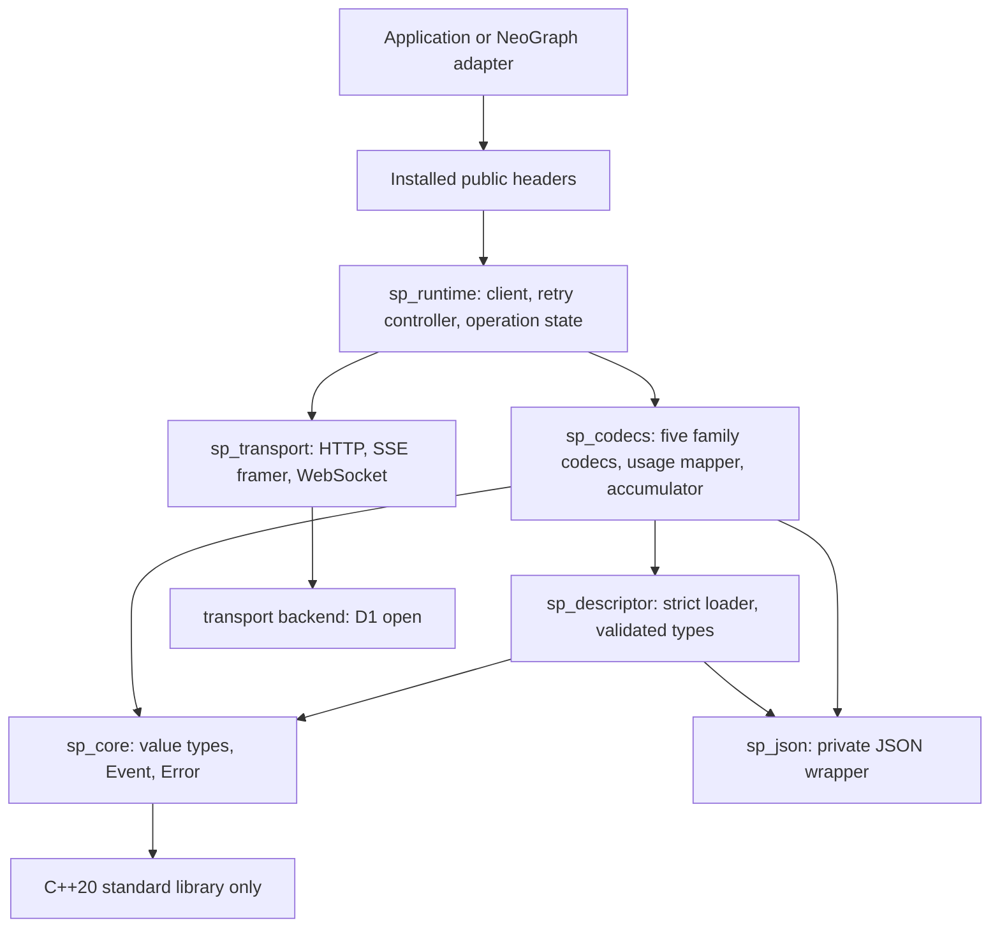

# SchemaProvider design

## 0. Status

**This is a design proposal. Nothing described here is implemented.** The repository contains no code. Every sketch below is a contract to be built and tested, not observed behaviour. Statements about other projects or about the current NeoGraph implementation are labelled as such and are summarised in [RESEARCH.md](RESEARCH.md). Testable requirements are tied to the named properties in [CONFORMANCE.md](CONFORMANCE.md) (written like `ChunkPartitionInvariant`). Decisions that are still open are in section 12 and must not be treated as made; decided questions and their reasoning are recorded in [decisions/](decisions/).

Words: MUST, SHOULD, MAY are used as in RFC 2119. "Family" means a wire protocol shape (Chat Completions, Responses, Messages, Gemini generate, Interactions). "Vendor" means an endpoint operator speaking a family. "Descriptor" means a JSON file of vendor values.

## 1. Thesis and non-goals

**Thesis.** The API family owns structure and state transitions in typed C++. A vendor descriptor supplies only the values of that structure. Every response path (buffered, SSE, WebSocket) is decoded into the same small set of semantic events and folded by one accumulator. The reason for the split is not speed; it is to shrink the change surface of a vendor update and to make "a wrong result reported as success" hard to express.

```
Request -> validated immutable plan -> one-attempt transport -> family frame decoder
        -> semantic Event -> ONE accumulator -> Completion | Failure
```

Non-goals:

- No generic bidirectional "universal IR" or gateway feature. Events are decoded one way and folded; they are never re-encoded into another vendor's wire format, and no event persistence format is promised.
- No cross-vendor continuity of native reasoning state (signed or encrypted reasoning cannot be translated).
- No public codec SDK, public transport port, executor framework, middleware chain, or binary plugin ABI. New families are source contributions.
- No descriptor scripting: no event actions, hooks, conditionals over state, templates or loops (section 5).
- No graph/agent runtime, tool execution, cost tables, tenant billing, circuit breaker, or cross-vendor fallback. Those stay in the host.
- No Python or other language bindings until the C++ API settles.
- Non-chat endpoints (image, long-running video operations, routing-decision endpoints) are not part of the first scope; see open decision D2. Nothing here claims they are supported.

## 2. Architecture

### 2.1 Layers and dependency direction

Arrows mean "depends on" (compile-time), not call flow.



Rules:

1. `sp_core` depends on the C++20 standard library only. It does not know HTTP, JSON libraries, descriptors, or NeoGraph.
2. Codecs are pure with respect to I/O: they consume frames and emit events; they never perform retries, sleeps, or sockets.
3. The transport reports one `AttemptObservation` (bytes sent, response headers seen, first output byte seen, close/reset kind) and never interprets semantics or retries.
4. Only the runtime owns retry, deadlines, cancellation and threads.
5. NeoGraph-specific pieces (coroutine bridge, graph cancellation token, journal digest) live in NeoGraph, not here.

### 2.2 Public vs private

Installed headers (proposed, six): `client.h`, `types.h`, `event.h`, `error.h`, `json_value.h`, `version.h`, under `include/schemaprovider/`. One installed target: `SchemaProvider::SchemaProvider`. The six headers are documentation boundaries, not six products. Header count is not a quality metric; the metrics are section 2.4.

Private (not installed, no stability promise): all `sp_*` object targets, codec headers, descriptor structs, transport ports, the retry controller, the reference model used in tests.

`JsonValue` is a small immutable owner of validated JSON text with parse/serialize and bounded lookup only. It has no DOM mutation, no raw parser pointers, no general transformation API. It exists so tool parameter schemas and tool arguments carry validation evidence (duplicate keys rejected, depth bounded) and are not re-validated at each boundary. Callers may read arguments with their own JSON library.

### 2.3 Third-party dependencies per layer

| Layer | Allowed dependencies |
|---|---|
| `sp_core` | C++20 standard library |
| `sp_json` | yyjson (private; never in a public header) |
| `sp_descriptor`, `sp_codecs` | `sp_core`, `sp_json` |
| `sp_transport` | one backend, chosen by D1 (Asio + OpenSSL, or libcurl plus platform TLS) |
| `sp_runtime` | the above, standard threads, `std::stop_token` |
| public headers | standard library only |

No language runtimes, no general JSON Schema validator, no second HTTP stack, no `httplib` in the new library. `SP_ENABLE_WEBSOCKET` selects a transport implementation only; it does not change the semantic contract. The embedded descriptor index is generated at configure time; there is no runtime directory globbing.

### 2.4 Include-direction gate

CI MUST fail when any of these hold (property `InstallAndDependencyDAG`):

- an installed header includes yyjson, asio, OpenSSL, `httplib`, curl, or any `src/` header;
- `sp_core` links or includes anything but the standard library;
- the CMake target graph has an edge from `sp_core` or `sp_descriptor` to `sp_codecs`, `sp_transport` or `sp_runtime`, or from `sp_codecs` to `sp_transport`;
- a clean consumer project fails to `find_package`, compile each public header standalone, link, and complete one loopback request against the installed tree.

The check reads compile commands and compiler dependency output, and inspects the target graph; it does not rely on grep of source alone. Structural indicators to track after implementation (not results): public dependency leaks = 0, accumulators = 1, retry owners = 1, vendor-name branches in shared code = 0, C++ files touched to add a compatible vendor = 0.

## 3. Core vocabulary

These are header-level sketches. Names may change; the invariants in the prose are the contract.

### 3.1 Origin

```cpp
namespace sp {
struct Origin {
  std::string family;      // "openai.responses", "anthropic.messages", ...
  std::string vendor;      // stable descriptor id, not a display name
  std::string authority;   // normalized effective host + API surface
  std::string route_scope; // caller-supplied non-secret binding (deployment, tenant, credential class)
};
bool operator==(const Origin&, const Origin&) = default; // exact equality only
}
```

Origin equality is exact on all four fields. There are no equivalence aliases between hosts (direct Anthropic, Bedrock, Vertex and OpenRouter are distinct authorities); signature interoperability between them is unverified (D4). `route_scope` is never key material and is never derived by hashing a credential. An origin label is not cryptographic proof of anything; it only gates local replay.

### 3.2 Native state and sealed capsules

```cpp
namespace sp {
// Immutable, shared, created only by trusted decoders or an explicit history importer.
class SealedCapsule {
 public:
  const Origin& origin() const;
  int representation_version() const;
  bool complete() const;                 // false => never replay natively
  std::span<const std::byte> bytes() const; // exact opaque bytes; never logged
  // owner part keys and original order are part of the capsule
};
struct NativeState { std::shared_ptr<const SealedCapsule> capsule; };
}
```

The capsule holds the whole native item or block, its owning part keys, its original position, the origin, a representation version, and a completeness flag. Opaque string values are never trimmed, re-encoded, or canonicalised. "Sealed" means C++ immutability plus provenance, not vendor signature verification.

Messages are immutable once produced by a decoder. Editing goes through an explicit builder; editing the text, order, or ownership of a part that owns a capsule invalidates that capsule's replay eligibility (the builder drops the seal, and a later native replay attempt fails with `ReplayIneligible` rather than sending a stale block).

### 3.3 Parts, Message, Request

```cpp
namespace sp {
enum class Role { System, Developer, User, Assistant, Tool };
struct Text       { std::string value; };
struct Media      { std::string mime; std::variant<Url, FileId, SharedBytes> data; };
struct ToolCall   { std::string id; std::string name; JsonValue arguments; }; // sealed args only
struct ToolResult { std::string call_id; std::string name; JsonValue value; bool is_error; };
struct Reasoning  { std::optional<std::string> visible; NativeState native; };
struct Refusal    { std::string text; std::string raw_code; };
struct Opaque     { std::string wire_type; NativeState native; }; // unknown optional item kept, not a JSON escape hatch
using Part = std::variant<Text, Media, ToolCall, ToolResult, Reasoning, Refusal, Opaque>;

struct Message {
  std::string id;                       // vendor item id when one exists
  Role role;
  std::vector<Part> parts;              // order is semantic
  std::optional<std::string> phase;     // e.g. commentary / final answer; open string
};

struct Request {
  std::string model;
  std::vector<Message> messages;
  std::vector<ToolDefinition> tools;    // name, description, JsonValue parameters
  Sampling sampling;                    // optional temperature, top_p
  std::optional<uint64_t> max_output_tokens;
  std::optional<StructuredOutput> output;
  std::optional<Continuation> continuation; // origin-bound server-side state reference
  std::vector<BoundOption> options;     // validated namespaced keys; not a raw body merge
  ForeignReasoning foreign_reasoning = ForeignReasoning::Reject;
};
}
```

Contracts:

- Part order inside a message and message order inside a completion follow the family's explicit item order or key, not network arrival order. Local ids are allocated canonically and are not identity.
- A tool call becomes executable only when its arguments are sealed: complete and validated JSON, with name and id present. An explicit empty object is distinct from missing arguments.
- `Continuation` is `(origin, opaque reference, representation version)`; a reference is never usable from a different origin even within the same family. Combining explicit history with a server continuation is allowed only in combinations the codec documents.
- One generation, one candidate. `n != 1` is `Unsupported`. Several ordered messages inside one generation (for example commentary, function call, final answer) are normal.
- `BoundOption` is obtained from `Client::option(key, value)`, which validates the key against the descriptor. A key that is not declared, or that collides with a typed field or a reserved path, is an error before any network I/O (`IntentOrError`).

### 3.4 Events

Ten semantic events, response-scoped, one-way. Attempt lifecycle, retries, acceptance, diagnostics and job polling are NOT events.

```cpp
namespace sp {
struct Begin        { std::string generation; Origin origin; };
struct MessageBegin { LocalId message; std::optional<std::string> vendor_id; Role role; std::optional<std::string> phase; };
struct PartBegin    { LocalId message, part; PartKind kind; PartHeader header; };
struct PartDelta    { LocalId part; DeltaPayload payload; }; // text bytes | visible reasoning bytes | tool-args JSON fragment
struct PartSeal     { LocalId part; SealedPart value; };     // authoritative final snapshot: reconcile, never append
struct MessageSeal  { LocalId message; };
struct UsageUpdate  { Usage snapshot; };                     // full normalized absolute snapshot
struct Stop         { StopReason reason; };
struct Commit       { TerminalEvidence evidence; };          // family terminal evidence verified
struct Fail         { Error error; };
using Event = std::variant<Begin, MessageBegin, PartBegin, PartDelta, PartSeal,
                           MessageSeal, UsageUpdate, Stop, Commit, Fail>;
}
```

Delta payload views are valid only for the callback duration. Retaining requires an explicit copy. Opaque reasoning bytes are never placed in delta events or logs.

### 3.5 Usage: unknown is not zero

```cpp
namespace sp {
enum class Evidence { Reported, Derived };
struct Count { uint64_t value; Evidence evidence; };
enum class UsageStage   { Missing, Partial, Final };       // independent axis
enum class UsageQuality { Consistent, Inconsistent };      // independent axis
struct Usage {
  std::optional<Count> input_total, output_total, total;   // total = known input+output
  std::optional<Count> provider_reported_total;            // kept verbatim, separate from `total`
  std::optional<Count> input_uncached, cache_read, cache_write, reasoning;
  UsageStage stage; UsageQuality quality;
  std::vector<UsageConflict> conflicts;                    // raw observations kept
};
}
```

- `nullopt` means unknown/unobserved. An explicit zero is a value. A consumer MUST NOT settle unknown as zero.
- The public `UsageUpdate` is a complete snapshot. The accumulator replaces its usage with it, so a `nullopt` in a later snapshot turns a previously known value back into unknown. This is how a late contradiction invalidates a stale number.
- Vendor counter semantics (a counter that is `Set` vs `Add`ed across frames, start-frame vs delta-frame usage) are handled privately by one shared `UsageMapper` that keeps a per-attempt source ledger. The public event never exposes source counters.
- Algebra: `input_total` includes cached tokens; `output_total` includes reasoning tokens; `cache_read`/`cache_write` decompose input; `reasoning` is a subset of output. Impossible relations make the affected derived counts unknown and record a `UsageConflict`; values are never clamped. Wrong types, negative values and overflow are `Corrupt`.
- Repeating the same final snapshot changes nothing. Estimated values are never labelled `Reported`. After a failure, usage is the last known partial snapshot.
- Cost tables, tool fees and retry-attempt billing are outside `Usage` (host metering).

Tested by `UsageKnowledgeTransitions` and `SnapshotNotAppend`.

### 3.6 Completion, Stop, Error

```cpp
namespace sp {
enum class Stop { EndTurn, ToolUse, MaxTokens, StopSequence, ContentFilter,
                  Refusal, PauseTurn, ContextLimit, Unknown };
struct StopReason { Stop kind; std::string raw; };

struct Completion {
  std::vector<Message> messages;         // ordered; Responses item ids/phases survive
  std::vector<Media> artifacts;
  StopReason stop;
  Usage usage;
  std::optional<Continuation> continuation;
  std::string request_id;                // vendor request id when the wire gives one
  std::vector<ConversionLoss> losses;    // reporting only; not part of completion identity
};

enum class ErrorKind { InvalidConfig, InvalidRequest, Unsupported, Authentication,
  Permission, NotFound, RateLimited, QuotaExhausted, LimitUnknown, Overloaded,
  Transport, ProtocolCorrupt, Truncated, RemoteFailure, ReplayIneligible,
  Cancelled, DeadlineExceeded, ResourceLimit };
enum class RetryClass  { Never, Transient, AfterReset, Unknown };
enum class RetrySafety { NotSent, PossiblyAccepted, OutputObserved };
struct Error {
  ErrorKind kind; RetryClass retry_class; RetrySafety retry_safety;
  int http_status; std::optional<int> websocket_close;
  std::string vendor_code, request_id, safe_message;
  std::optional<std::chrono::milliseconds> retry_after;
  AttemptObservation attempt;            // what was sent/seen; a failed attempt is never assumed free
};
struct Failure { Error error; PartialCompletion partial; };
using Outcome = std::variant<Completion, Failure>;
}
```

Stop semantics (`StopMeaning`): when a completion contains a tool call, `end_turn`/STOP is normalised to `ToolUse`; `MaxTokens`, `ContentFilter`, `PauseTurn`, `ContextLimit`, `Refusal` are valid terminals and MUST NOT be reported as `EndTurn`; an unmapped raw value is `Unknown` (never `EndTurn`) and only appears when terminal evidence exists. Transport truncation is `Failure(Truncated)`, never a stop reason.

Retry classification:

- `RetryClass` says whether the failure kind could clear up (status/code tables from the descriptor, checked with quota/rate codes first). `RetrySafety` says whether repeating the request could duplicate billable work or output; it is derived from transport evidence, never from descriptor data.
- `RetrySafety` values: `NotSent` (transport proves no request bytes were accepted), `PossiblyAccepted` (bytes sent, no output observed; includes timeouts after send and 5xx without a documented "rejected before generation" contract), `OutputObserved` (any semantic output was delivered).
- Quota vs rate limit: `QuotaExhausted` (for example an insufficient-quota code, a documented tier exhaustion) is `Never`. `RateLimited` with a transient reset is `AfterReset`. A 429 that cannot be told apart is `LimitUnknown` with class `Unknown`: not retried automatically. The absence of `Retry-After` alone never turns a 429 into quota.
- `request_id` is taken from the response header/body by a descriptor-declared priority list; the library never invents one. A local correlation id, prompt hash, or seed is not an idempotency key.

## 4. Streaming

### 4.1 Frame classes

A family decoder turns transport frames into one of three classes (`KnownCorruptNeverIgnored`):

| Class | Definition | Effect |
|---|---|---|
| Known | recognised tag with a valid payload | mapped to events |
| Unknown | unrecognised tag or property that the family explicitly marks optional | ignored or preserved as a bounded `Opaque` part; never contributes terminal, usage, or text |
| Corrupt | recognised tag with wrong type or missing required field, or an unrecognised item whose criticality is unknown | run fails with `ProtocolCorrupt` (or `Unsupported` when criticality is unknown) |

Unknown is never a silent fallback for Corrupt. Unknown items are never guessed into empty text, usage, or a terminal.

Framing details owned by the SSE framer: UTF-8 and BOM handling, CR/LF/CRLF, multi-`data:` lines joined with LF, dispatch on blank line, comments/heartbeats are liveness only, and a pending event without its blank line at EOF is discarded and left to the terminal check. WebSocket control frames never reach a codec. Splitting the byte stream at any position MUST NOT change frames or the outcome (`ChunkPartitionInvariant`).

### 4.2 Terminal evidence

`Commit` requires family terminal evidence; EOF alone is never evidence (`NoTerminalNoSuccess`):

| Family | Terminal evidence |
|---|---|
| Chat Completions | chosen candidate has a finish reason, and the `[DONE]` marker for standard SSE (a usage-only trailer before it is accepted); a compatible variant without the marker needs a reviewed terminal profile in the codec |
| Messages | stop reason delivered and `message_stop`, all content blocks closed; start-frame and delta-frame usage merged |
| Responses (HTTP, SSE, WS) | completed / incomplete / failed / cancelled statuses are distinguished; completed and incomplete reconcile the full snapshot then commit; failed and cancelled are `Failure`; a WS socket close is not a response terminal |
| Gemini generate | candidate finish reason or an explicit prompt block, all parts and usage processed, normal EOF; EOF without finish reason is `Truncated` |
| Interactions | interaction terminal discriminator and item lifecycle verified by its own codec; rules are not inferred from the other families |

A 200 status with an error body, an in-band error event, a failed Responses status, and an early WS close are all failures.

### 4.3 Accumulator state machine

One accumulator, no per-transport finalizer, single completion notification (`NoTerminalNoSuccess`, exactly-one-outcome part of `OwnershipAndBounds`).

| State | Allowed transitions / notes |
|---|---|
| `Created` | `Begin` -> `Receiving`; request or transport failure -> `Failed` |
| `Receiving` | message/part begin, delta, seal; `UsageUpdate`; `Stop` -> `Draining`; `Fail` -> `Failed` |
| `Draining` | only part/message seals and usage trailers the codec allows; a new text/tool delta is an error; `Commit` -> `Succeeded` |
| `Succeeded` | all required parts sealed, stop present, terminal evidence verified; exactly one completion notification |
| `Failed`, `Cancelled`, `DeadlineExceeded` | partial data is observation only; later events are ignored |
| EOF or close in a non-terminal state | consult the family close contract; otherwise `Truncated`; EOF never synthesises `Commit` |

Per-part state is `Unseen -> Open -> Sealed`. Delta before begin, delta after seal, and an id reused with a contradictory header are errors. A codec may synthesise begin/seal only where the wire protocol defines them implicitly.

Ownership of text and argument accumulation belongs to the accumulator; codecs keep only wire-id-to-local-id maps, signature fragment assembly, and their private usage source state. This avoids a second buffer implementation. The accumulator is an owned mutable cursor with a borrowed emission sink; it does not copy whole state per frame. Per-delta heap allocation is avoided.

`PartSeal` is a reconcile step: a final snapshot that contradicts observed deltas is `ProtocolCorrupt`; a snapshot that only extends an unsealed prefix is accepted. Final snapshots are never appended to what was already streamed (`SnapshotNotAppend`).

Bounds: frame bytes, total bytes, part count, tool argument bytes, opaque bytes, queue size, and idle time are configured and enforced; exceeding one is `ResourceLimit`, never silent truncation into success (`OwnershipAndBounds`).

### 4.4 Tool-call assembly and interleaving

- Tool key is `(generation, message/item/block index)`. The vendor call id is a separate binding on that key. Fragments for calls A and B may interleave arbitrarily; each is appended to its own part buffer in order (`InterleavedToolOwnership`).
- Name and id fragments assemble per key. A "last tool" pointer or index-only association is not acceptable when two calls are open.
- Where the wire has no call id (Gemini), the library assigns an operation-local stable id and keeps the wire name/part association. It never generates a new random id per chunk.
- Arguments are not parsed per fragment. They are validated once at seal. An initial `""` is not repaired to `{}`; `{}` is accepted as complete only where the protocol defines it as the no-argument value. A call with unsealed arguments is partial data, never an executable call.
- Signatures attach to the owning call or block by key, not by parallel lists. OpenRouter reasoning fragments merge by `(type, index)`; entries without an index stay independent and are not de-duplicated by guesswork.

### 4.5 Usage during streaming

The family decoder feeds source observations to the `UsageMapper` (start-frame input and cache, delta-frame output, final totals). The mapper emits absolute snapshots; the accumulator replaces. A source counter that is absent stays as previously observed; an explicit zero overwrites; final snapshot precedence is decided by family code. Anthropic-style input arriving in an earlier frame than output is therefore not lost, and a repeated final snapshot does not double count (`UsageKnowledgeTransitions`, `SnapshotNotAppend`).

### 4.6 How buffered, SSE and WebSocket converge

```
buffered JSON body ─┐
SSE bytes -> framer ─┼─> same family decoder -> Event -> same accumulator
WS messages ─────────┘
```

A buffered body is walked item by item through the same `interpret_item` routine that streaming uses, producing the same begin/seal/usage/stop/commit events; no artificial byte-level deltas are invented. `complete()` has no parser of its own. For one scripted logical reply, buffered, SSE and WS produce equal messages, usage, stop, native state and journal projection (`TransportProjectionParity`). A change to semantic decoding touches a codec file, not a transport file.

Responses WebSocket: one in-flight generation per session by default; frames are dispatched by response id; a stray frame after a terminal is a connection protocol violation that discards the session and does not alter the delivered outcome; reconnect is transport recovery, never automatic resume of a half-finished generation.

## 5. Data vs code boundary

### 5.1 What a descriptor may contain

Descriptors are trusted deployment input (no remote refresh, no external `$ref`). Top level is closed: unknown or duplicate keys are errors.

| Key | Content and limits |
|---|---|
| `descriptor_version`, `revision`, `id`, `family`, `evidence` | integers, stable vendor id, an installed family id, documentation URLs and verification date (non-executable metadata) |
| `connection` | HTTPS base URL, relative paths per mode, fixed slots `{model}` and `{operation_id}`, auth header/query name and prefix, credential binding name, literal / required-env / optional-env headers, request-id header priority |
| `models` | exact or terminal-`*` prefix selectors, API-version and account-scope conditions, capability Supported / Unsupported / Unverified with verification date, numeric limits; resolution order exact, longest prefix, default; equal-rank conflict is an error |
| `bindings` | member names and paths for slots the codec declared (for example a request field name, a reasoning text path, a usage root). A path is a list of escaped object-member segments: no wildcard, filter, array iteration or computation |
| `options` | `namespace:key`, type scalar / list / closed record, enum or range, default, destination slot, model selector; closed records do not recurse and have no union or `$ref` |
| `usage` | per-counter source path, unit, meaning of absence (unknown, or zero when the vendor documents it); disjoint finite source sums per destination; subset relations. No constants, products, or expressions |
| `errors` | code/type to kind and retry class; retryable status and code lists; quota and rate code lists; fixed machine-field readers. Quota codes outrank status. `RetrySafety` cannot be set by data |
| `stop_reasons` | raw string to an existing `Stop`; default is `Unknown`, never `EndTurn` |
| `constraints` | exactly three rule kinds (below) and exact/prefix lists for temperature exclusion |

The three closed rules: `RequireGreater(lhs_slot, rhs_slot)`, `RequireEqualWhen(target_slot, literal, selector_slot, enum_set)`, `OmitDefaultWhen(target_slot, selector_slot, enum_set)`. A selector reads one enum slot of the original validated request; there is no nesting or boolean composition. Rules read the same original and are order independent; contradictory rules on one destination are a load error; omitting a caller-supplied value is an error (only library defaults may be omitted).

A descriptor cannot: template message content, loop or branch, dispatch on events, register callbacks or named rewrite hooks, script, merge arbitrary body fragments, merge roles, correlate items, assemble signature fragments, choose terminals, perform retry, run token commands, fetch anything, or carry vendor-name conditionals. Those are C++.

### 5.2 Load-time validation

Loading is: strict JSON parse (duplicate keys rejected, size and depth bounded) -> closed type and unknown-key check -> match against the family's slot inventory -> checks for path collisions, reserved destinations, model-selector priority, rule contradictions, and usage source overlap -> `ValidatedDescriptor`. Errors carry the JSON pointer, expected type and revision, and never a secret. There is no coercion or migration on load; a future `descriptor_version` or an unknown key is an error. A changed endpoint changes where credentials are sent, so the factory applies an endpoint allow-policy. Clients are immutable: a new descriptor means a new `Client`, so an in-flight request never changes revision or origin.

### 5.3 Schema is generated from the C++ inventory

The typed common field inventory plus each family's slot inventory is the single grammar authority. `descriptor-v1.schema.json` is generated from it; it is not hand-written. CI checks that the published schema and the runtime loader agree on a corpus of accepted and rejected instances. Cross-field invariants (path collisions, rule contradictions) are runtime checks; the schema documents that it does not cover them. A schema pass alone is never evidence of typo rejection.

### 5.4 Growth-cap rule

Never, regardless of the number of use cases: stateful rules, ordered or chained rules, fragment correlation or merging, event dispatch, callbacks or named hooks, side effects, dynamic paths, vendor-name inspection. If a new key would need an execution order, a new state, or a dynamic reference, it is rejected and goes to family C++ (or a small typed sub-codec). A new stateless rule kind is admissible only through the process in D5. Descriptor coverage percentage is not a target. The hardest judgment in this design is classifying "same family, different values" versus "new wire semantics"; that is why the extension walkthroughs (section 9) list exact touch sets and record the actual set for each real change.

## 6. Reasoning carry

Vendor reasoning state (signed thinking blocks, encrypted reasoning items, thought signatures) is opaque, origin-bound, and not portable.

**Capture.** Decoders capture reasoning by default, separately from visible text: Messages thinking and redacted blocks with order and signature; Responses reasoning items with id, encrypted content and summary; Gemini thought parts and signatures with the function-call association; OpenRouter `reasoning_details` as a whole. A gateway's `format` field is an internal provenance hint, not a replay permission. Capturing a signature is independent of whether the caller asked for visible thoughts.

**Replay gate.** Native replay requires an exactly equal `Origin` (family, vendor, authority, route_scope), a complete capsule, and the codec's binding checks (for example the surrounding context has not changed where the vendor binds signatures to it).

| Treatment | When | Result |
|---|---|---|
| Native | same origin, complete capsule, gate passed | replay verbatim. Unsigned, empty, or redacted blocks are replayed as they were captured. Invalid or incomplete capsule: `ReplayIneligible`, no silent demotion |
| Explicit demotion | foreign origin, and the caller set `ForeignReasoning::DemoteReference` | only public visible text or summary, as clearly labelled reference context in a user-level message; a `ConversionLoss` is recorded. Signature, encrypted and redacted bytes are never exposed as text |
| Drop | foreign origin, and the caller set `ForeignReasoning::Drop` | reasoning removed; `ConversionLoss` recorded. Not a claim of continuity |

Default for a foreign capsule is **Reject** (request fails before dispatch with `ReplayIneligible`). Drop and Demote are opt-in only.

Rules that are not relaxed:

- **Same-origin unsigned blocks are never demoted or dropped** (a missing signature is not evidence of a foreign origin).
- A tool loop (outstanding call, result, and the same vendor's follow-up) cannot cross origins; a mid-loop vendor switch is refused. Imported history without provenance needs a verified continuation envelope.
- The library never strips reasoning and retries after an error, and never silently rewrites history to make a request pass.
- Gemini's documented sentinel for missing signatures is only usable under an explicit `AllowDocumentedSentinel` approval for completed foreign history, with a recorded quality loss; otherwise a missing required signature is a pre-dispatch error.
- Editing visible text, compacting history, or changing system/tools can invalidate vendor-side bindings. The builder drops the affected seal; the caller must resend without native state or satisfy the codec binding rule.

**Sensitivity.** Opaque reasoning is redacted by default in logs, errors, telemetry and exceptions. Storage is opt-in and the host is responsible for encryption, access control, and retention. Portable export excludes reasoning secrets; a continuation archive export needs an explicit secret-bearing warning and an integrity/provenance envelope. Public test fixtures replace opaque payloads with synthetic ones and are marked as not proving native acceptance.

Tested by `NativeRetentionForeignGate`. A same-origin live canary (a real second request accepted by the vendor) complements the synthetic tests.

## 7. Resilience

**One retry layer.** Default is one attempt per logical request and zero automatic retries. Retry exists only in the client runtime's single `RetryController`, only when enabled. Transport and codec never retry. If the host (for example NeoGraph) owns retry, the library's retry stays off. Gateway-side retries are documented as operational facts, not controlled by the client.

**Retry condition.** A retry happens only if all hold: `RetryClass` is Transient or AfterReset; `RetrySafety` permits (NotSent, or a documented safe-by-contract rejection; never `OutputObserved`; `PossiblyAccepted` only when the endpoint documents idempotency-key consistency and the same key is reused, or when the caller sets an explicit duplicate-billing-risk policy); budget and deadline remain; no semantic output has been delivered. A new attempt is never appended to the previous attempt's partial output. Absence of a stream callback is not a safety argument (`RetrySafetyBudgetDeadline`).

**Budget.** Logical attempt cap, one absolute monotonic deadline, and a shared retry token bucket per runtime and credential-origin. Opt-in example defaults: at most 3 attempts (a proposal, to be validated against workloads). Cross-process budgets belong to the host.

**Backoff.** Capped exponential with full jitter: `Uniform(0, min(cap, base * 2^n))`. `Retry-After` (seconds, HTTP date, or a supported millisecond header) is a minimum: wait `max(server_minimum, jitter)`. If that wait exceeds the remaining deadline or budget, stop with the error; do not shorten the wait. Dates are converted to monotonic remaining time at receipt. Clock and RNG are injectable.

**Deadlines and cancellation.** One absolute deadline and one `std::stop_token` reach connect, DNS, TLS, request write, response read, WS handshake, stream read, and backoff. Idle timeout supplements but does not replace the deadline. Cancellation stops local waits, sockets and queued callbacks and yields exactly one `Failure(Cancelled)`; it does not promise that the vendor stops generating or billing.

**Threads and API shape.** Async-native private core with a blocking `complete()` facade (`Outcome complete(Request, RunOptions)`) that waits on the same operation as `start(Request, RunOptions, Callbacks)`. The runtime owns a bounded set of I/O threads; there is no thread per request; no Asio, coroutine, or executor type is public. Whether async-native is required at all is D3.

**Callback and lifetime contract** (`OwnershipAndBounds`):

- The operation state owns the callback closure; there is no borrowed observer.
- Callbacks are serialized per operation; event views are valid only for the call.
- The destructor of the operation handle performs a non-blocking cancel and blocks further callback admissions. It does not wait for a running callback.
- `join()` is an explicit fence that waits until no callback is running; calling it from the callback thread is an error, not a deadlock.
- A callback may drop the last reference to its own handle without deadlock or use-after-free; the operation state outlives the running callback.
- Exactly one outcome is delivered, and no callback runs after the fence completes. Cancel/error/terminal races produce one outcome.
- Blocking `complete()` and `join()` are rejected when called from an I/O callback.

Public logs and errors never contain secrets, opaque reasoning, or raw bodies; headers are exposed through a bounded allow-list; raw body capture is opt-in.

## 8. Consumer contract: NeoGraph adapter and journal

The library never computes a NeoGraph digest. It provides a lossless, versioned `completion-envelope` serialization; NeoGraph owns the digest.

**NeoGraph adapter (in the NeoGraph repo).** Bridges the library to NeoGraph's coroutine model and its cancellation token (converted to `std::stop_token`), and maps `Completion` to NeoGraph's own types. The library knows nothing of graphs, journals, or tool executors.

**`provider-completion/v2` is an explicit cutover.** The existing `provider-completion/v1` digest is computed over message, stop reason, and three usage numbers (as observed in the current implementation, per RESEARCH.md); it cannot express unknown-vs-zero usage, several ordered messages, origin, or continuation without inventing values. Therefore no fake zeros are written to keep v1 alive, and v1 is not reinterpreted.

| Included in the v2 canonical record | Excluded |
|---|---|
| semantic version; ordered messages and parts with part boundaries, vendor ids and phase; tool ids/names/sealed arguments; stop raw value and normalised kind; nullable usage with per-count provenance, stage, quality, `provider_reported_total`; native state identity (origin, representation version, canonical native projection); continuation (origin, reference, representation version); artifact identity | chunk boundaries, transport mode, local ids (canonically remapped from semantic order), timestamps, `request_id`, `losses` and other diagnostics, retry attempt facts |

- **Projection vs raw bytes.** Digest input is a versioned canonical projection: JSON structure is compared semantically (member order and whitespace are not identity) while opaque string values and any leaf a vendor binds as raw representation are exact bytes. Raw capture bytes are an archive-integrity concern, separate from semantic identity. Parity across transports is required only for fixtures with the same replay representation.
- **Conversion receipts.** Explicit demotion/drop approvals and loss notices are kept in a dispatch/conversion receipt outside completion identity. Text produced by demotion is part of the following request's identity because it is part of what is sent.
- **Pre-dispatch version gate.** NeoGraph checks the journal version, and the version of the provider-call record, before sending the request. A mismatch stops the run with no billable call, not after.
- **v1 reader stays immutable.** Old records are verified with their stored original serializer; digests are never overwritten or rehashed in bulk. A paused v1 program is not resumed on the new library; migration is an explicit checkpoint that creates a new v2 run whose parent provenance is the v1 digest. Imported reasoning is never auto-promoted to native-eligible, and no unknown origin is invented.
- **Storage.** Whether opaque payloads are stored inline or by content hash is a host policy. The canonical payload identity, retrievability, and representation version are fixed; the library does not require a content-addressed store.

Tested by `JournalVersionAndCanonicalOrder` (pinned v1 bytes and hashes, v2 null-vs-zero, origin and native-byte change detection, invariance under partition and local-id changes).

## 9. Extension walkthroughs

Paths are the proposed layout; none exist yet. A fixture is one JSON case file (request, transport schedule, expected, provenance); only large binary wire data goes to a sibling file. Docs capability tables are generated from descriptors, so no shared test C++ changes when a vendor is added. Every change also touches `CHANGELOG.md`.

**(a) Add an OpenAI-compatible vendor `acme` (Chat Completions shape). Zero C++.**
- `descriptors/vendors/acme.json`
- `descriptors/manifest.json`
- `fixtures/chat_completions/acme-basic.json` (and a tool-stream case)
- `docs/providers/acme.md`, `CHANGELOG.md`

The fixture proves the request body (including semantic headers) and the response mapping. If `acme` needs different stream lifecycle or new state semantics, it is not case (a): reclassify as (c) or (d) rather than trusting the word "compatible".

**(b) Add an optional request field to an existing vendor (for example a Responses `service_tier` scalar). Zero C++ when an existing scalar / list / closed-record option slot can carry it.**
- `descriptors/vendors/openai-responses.json`
- `fixtures/responses/service-tier.json`
- `docs/providers/openai-responses.md`, `CHANGELOG.md`

Callers use `client.option("openai:service_tier", value)`. If the field needs a portable typed `Request` member, or changes continuation, prompt ordering, response interpretation, or tool lifecycle, it is C++: `include/schemaprovider/types.h`, `src/codecs/responses.cpp`, plus tests. It is then not advertised as data-only.

**(c) A vendor changes a stream event meaning (for example a new tool-argument event in Responses). C++ required; transport files untouched.**
- `src/codecs/responses.cpp`
- `fixtures/responses/tool-args-new-event.json`
- `docs/protocols/responses.md`, `CHANGELOG.md`

The same decoder serves buffered, SSE and WS, so the generic parity suite covers all transports. A new raw stop string alone is not (c); it is a descriptor `stop_reasons` edit. A new kind of part that the ten events cannot express is a core change with a major release: `types.h`, `event.h`, the accumulator, the reference model in tests, and contract docs.

**(d) A genuinely new wire family `acme-dialog`. C++ required.**
- `src/codecs/acme_dialog.h` (declares its descriptor slot inventory), `src/codecs/acme_dialog.cpp`, `src/codecs/registry.cpp`, `CMakeLists.txt`
- `descriptors/vendors/acme-dialog.json`, `descriptors/manifest.json`
- `fixtures/acme_dialog/basic.json`, `fixtures/acme_dialog/tool-loop.json`
- `docs/protocols/acme-dialog.md`, `CHANGELOG.md`

Goal: the common loader, accumulator and transport stay untouched. A new transport is a further `src/transport/<name>.cpp` and is not data-only.

Summary: (a) and (b, simple scalar) need zero C++; (c) and (d) need C++. The measurable target: cases (a)/(b) touch no C++ file; a semantic stream fix touches no transport file.

## 10. Versioning and stability

- **Source API.** SemVer for the C++ source API. Changes that affect exhaustive visitors over `Event`/`Part`/`ErrorKind` or any specified meaning are major. A new option slot entry or a new source-level codec is minor. A fix to violated behaviour is a patch with a semantic release note.
- **ABI.** No stable cross-compiler ABI is promised. Shared builds are supported only with the same toolchain, standard library and flags; consumers rebuild per release. SONAME and symbol diffs are evidence but do not replace behavioural checks.
- **Descriptor.** `descriptor_version` (grammar) and `revision` (vendor facts) are separate. Grammar growth or meaning change bumps the descriptor major; correcting a fact bumps `revision` and must add fixture evidence. Exact-version support: newer versions and unknown keys are rejected. Changing a retention or usage-inclusion rule in data is still a semantic release even if it is one line.
- **Fixtures and envelopes.** `fixture_version`, `completion-envelope` version, and NeoGraph `provider-completion` version are independent. Changing a fixture's expected meaning needs a justification and a reviewed old/new diff; expected files are never regenerated and approved unread. Old serialized artifacts are read by version-specific readers; there are no aliases or shims to the live API.
- **Runtime reload.** No live reload. New descriptors mean a new immutable client.

## 11. Pre-mortem: likely two-year failure modes

| Failure | Early warning | Response |
|---|---|---|
| Descriptors turn into a programming language again | a rule used by one vendor only; a proposed hook; ordering dependence between slots | section 5.4 review and CI check; state goes to typed sub-codecs; track semantic modules touched per change rather than opcode count |
| "Compatible" differences eat the Chat family | vendor-name `if` in shared code; giant switch with 3+ vendors; a forked parser | absorb only what value slots express; structural differences become a separate typed family or sub-codec; never fork the accumulator |
| Opaque preservation and the public model drift apart | replay 400s increase after text edits; unknown critical items; signature mismatch | keep whole block with owner and order; same-origin unsigned regression; strengthen origin and context binding; never auto strip-and-retry |
| The single accumulator becomes over-abstract | each new family adds special cases or flags to common events | new event meaning requires major review; family causality stays in the codec; keep the small independent reference model current |
| Fixtures are green while live behaviour drifts | stale `evidence` dates; skipped canaries; rising unknown-tag counts; manual re-record spikes | per-model/host canary budget; immutable reviewed recordings; Unverified never auto-promoted to Supported; a skipped canary is not green |
| Retry and usage models under-report real cost | retries after `OutputObserved`/`PossiblyAccepted`; unknown settled as zero; early calls despite `Retry-After` | single retry owner; attempt evidence separate from final usage; conservative handling of unknown; overload-recovery scenario in tests |

## 12. Open decisions

None of these is decided by this document. Each must be resolved (and recorded in `docs/decisions/`) before the affected area is implemented.

### D1. Transport backend (single choice; must not leak into public API/ABI)

- **Options.** (A) Private Asio + OpenSSL, extracting the working parts of what NeoGraph already uses. (B) libcurl with platform TLS as the only transport.
- **Evidence so far.** NeoGraph's existing engine already uses Asio + OpenSSL, and its async contract is built on it; reusing it avoids swapping dependency and async model at the same time. The current implementation has several HTTP/SSE/WS paths with split ownership (per the RESEARCH.md measurements), so reuse must be extracted, not copied. libcurl is mature for HTTP and TLS and would remove hand-written HTTP; its WebSocket support, footprint, cancellation semantics, and shutdown behaviour for this workload have not been measured. No comparative footprint or performance data exists.
- **What would decide.** Run the same conformance suite, cancellation/shutdown scenarios, WS scenario, and a footprint report (installed size, shared libraries, idle threads, per-stream memory) against both, for equal feature scope. Pick one; do not ship both.

### D2. Scope of non-chat features

- **Options.** (A) Chat-family generation only for the first release; existing image, Veo/long-running operation, and routing-decision consumers stay in NeoGraph until an explicit migration decision. (B) Include typed image/operation/decision codecs with a private operation driver for polling. (C) Include a subset.
- **Evidence so far.** The current NeoGraph tree has schemas for video generation submit/poll, image generation, and an OpenRouter decisions endpoint (RESEARCH.md), so these consumers exist. Long-running operations need lifecycle (polling, cancel, artifact) that the ten events deliberately do not carry; adding a public pending event would ripple into every chat consumer's visitor. No decision on whether the existing consumers migrate exists.
- **What would decide.** The NeoGraph owner's inventory of live non-chat users; whether they can stay on the old code path; a prototype showing the operation driver can converge on `Completion`/`Failure` without widening `Event`.

### D3. Justification threshold for the async-native core

- **Options.** (A) Async-native private core plus blocking facade (current converged direction). (B) Blocking-only calls, with the host scheduling on its own bounded blocking pool.
- **Evidence so far.** Long-lived streams occupying host workers can delay short calls (a scenario argued from design; no measurement). NeoGraph's existing async contract sits on Asio (RESEARCH.md). NeoGraph's real target concurrency is unknown, so the threshold cannot be evaluated.
- **What would decide.** First fix target peak concurrency C. Proposed (unvalidated) thresholds for switching to blocking-only: with C and 2C mixed long SSE/WS plus short calls, worker-bridge admission delay p99 below 5% of baseline time to first token, cancellation completion p99 within 100 ms, within agreed thread and memory budgets, and shutdown/self-destruction scenarios pass, with fewer production ownership and cancellation paths than the async prototype.

### D4. Origin granularity: is host / route_scope required?

- **Options.** (A) Origin includes normalized authority and route_scope (converged default). (B) Origin is `(family, vendor)` only, with host equivalence classes added later. (C) Explicit, narrowly scoped equivalence classes per documented interoperability.
- **Evidence so far.** Failures in other projects came from lax provider matching and dropping same-provider unsigned thinking (issue references in RESEARCH.md). Whether a signature produced by Anthropic direct is accepted through Bedrock, Vertex, or OpenRouter is unverified, as is the reverse. Exact-origin equality is the safe default and can be relaxed without breaking callers; relaxing later is cheaper than tightening.
- **What would decide.** Vendor documentation of interoperability for a scoped host/tenant/model, plus a passing signed, encrypted, unsigned and tool-loop canary for that class. A successful canary alone does not justify universal portability.

### D5. Admission rule for new descriptor rule kinds

- **Options.** (A) Freeze at the three rules; anything else is C++. (B) Admit a new stateless rule only when it repeats across independent real cases (a number to choose: two or three) with a full truth table, permutation tests showing order independence, and a prototype that reduces duplicated semantic code without increasing touched production files. (C) Case-by-case review without a numeric bar.
- **Evidence so far.** Declarative gateways in the research accumulated conditional labels and named special handling, and then hooks; the current NeoGraph interpreter already carries 21 closed strategies (RESEARCH.md). The design authors agreed on "no state, ordering, or side effects ever" but not on the number of independent cases (two vs three) or the size of the prototype improvement.
- **What would decide.** The first three real descriptor-only vendor additions and the first proposal that hits the boundary; measure semantic duplication and touch counts on about ten recent changes replayed against both designs.

## 13. Keep from the current NeoGraph implementation, and drop

(Based on measurements of the current code summarised in RESEARCH.md; behaviour of the new library is still proposed.)

| Keep | Why |
|---|---|
| Vendor endpoints, header lists, knobs, retryable codes, model patterns as JSON | These change often and do not need a compile |
| Header token / CRLF validation, required vs optional variables, model-pattern temperature exclusions | Already encode useful safety and vendor facts |
| Usage inclusion tables (Anthropic cache, Gemini thought tokens) as data | Vendor facts; algebra becomes typed and shared |
| Whole-block reasoning preservation and `(type, index)` merging | Prevents signature loss and fragment mix-up |
| tool + STOP normalised to `ToolUse`; length/filter preserved | Correct stop meaning is a consumer contract |
| Opt-in total-wait budget, retryable classification | Basis of the single retry layer |
| Existing assertions on wire contract, reasoning carry, and usage that reflect real requirements | Moved as reviewed goldens; expected values checked against the requirement, not the old output |

| Drop | Why |
|---|---|
| Parallel `OpenAIProvider` request path beside the descriptor-driven one | One factory and one codec per family |
| Catch-all skip of malformed stream frames; opt-in terminal validation | Corrupt must fail; terminal evidence is mandatory |
| Separate SSE and WS usage/finalizer logic; positive-only usage merge; missing or non-numeric coerced to 0 | One accumulator; unknown is not zero |
| Provider-name string checks in shared mapping code (for example merging by provider name) | Move to the family codec's wire rules |
| Guessing foreign origin from a missing Gemini signature; direct replay of `reasoning_details`; prepending carry blocks | Replaced by the origin gate and original block order |
| Public exposure of asio, graph cancellation types, raw yyjson, mutable schema lock, free-form `extra_fields` | Standalone contract, `std::stop_token`, descriptor-validated options |
| Expectation that a cut stream without a callback is retry-safe; EOF treated as success | Replaced by RetrySafety and terminal evidence |
| Multiple HTTP stacks in the new library | One private transport, D1 |
